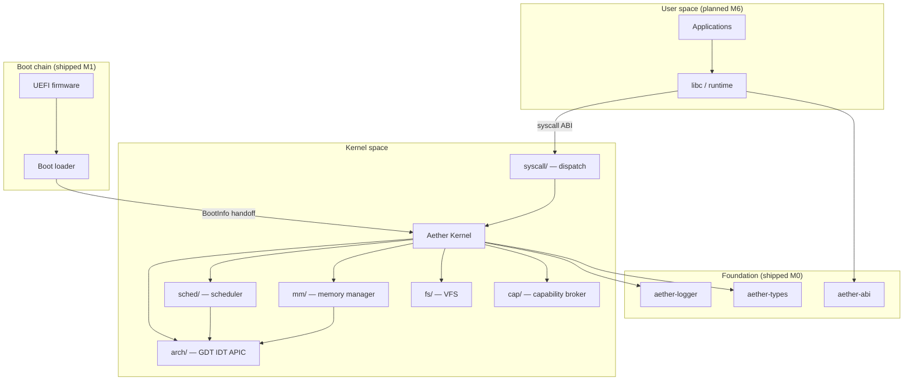
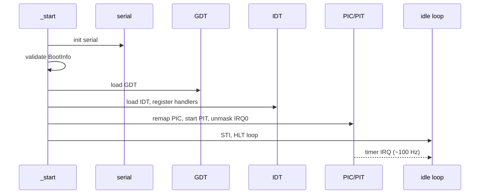
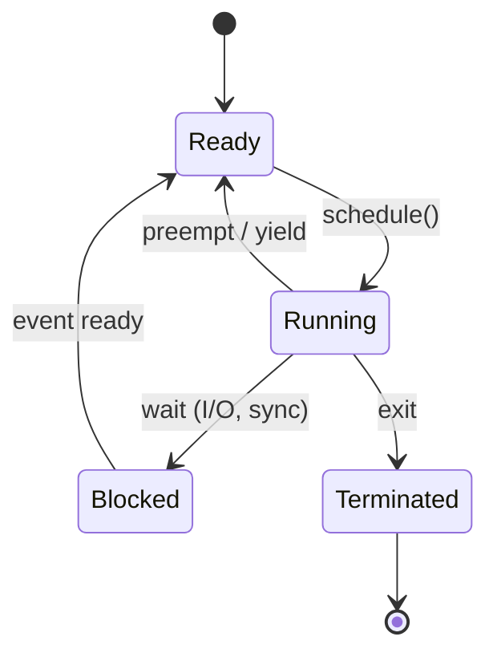

# Aether OS Architecture

This document describes the **design intent** and **shipped behavior** for Aether OS.
Status markers distinguish what is implemented from what is planned. Unless explicitly
marked **shipped**, subsystems described here are **not implemented** at runtime.

**Current milestone:** M2 — GDT, IDT, legacy PIC + PIT timer, serial diagnostics in QEMU.

## Overview

Aether OS is a security-first, Rust-native operating system targeting **x86_64**
with a **UEFI** boot path. The kernel follows a **modular monolithic** model:
subsystems live in one privileged address space but are organized as explicit
modules with documented boundaries.



## Kernel subsystem map

Detailed subsystem index: [docs/architecture/README.md](docs/architecture/README.md).

| Subsystem | Path (planned) | Milestone | Status |
|-----------|----------------|-----------|--------|
| Foundation crates | `crates/` | M0 | **Shipped** |
| Boot loader | `boot/` | M1 | **Shipped** (QEMU) |
| Early console | `kernel/src/serial.rs` | M1 | **Shipped** |
| CPU / interrupts | `kernel/src/arch/x86_64/` | M2 | **Shipped** (PIC/PIT; APIC planned) |
| Memory manager | `kernel/src/mm/` | M3 | **Planned** |
| Scheduler | `kernel/src/sched/` | M4 | **Planned** |
| Syscalls | `kernel/src/syscall/` | M4 | **Planned** |
| Capabilities | `kernel/src/cap/` | post-M4 | **Planned** |
| VFS | `kernel/src/fs/` | M6 | **Planned** |
| Networking | `kernel/src/net/` | M7 | **Planned** |
| Graphics / input | `kernel/src/gfx/`, `input/` | M8 | **Planned** |
| Packaging (platform) | `tools/aether-pkg/` | M9 | **Planned** (spec: [docs/packages/](docs/packages/)) |
| Atomic updates | boot + `system/update/` | M10 | **Planned** (spec: [docs/updates/](docs/updates/)) |

## Supported hardware

| Tier | Platform | Status | Notes |
|------|----------|--------|-------|
| **Tier 1 (dev)** | QEMU `qemu-system-x86_64` + OVMF (UEFI) | **Shipped** — serial boot in CI | Primary development target; `q35` preferred |
| **Tier 2 (experimental)** | Real PC, UEFI, x86_64 | Not tested | Supported in principle; no compatibility guarantees until hardware matrix entries are verified |
| **M13 (planned)** | QEMU `qemu-system-aarch64` + `virt` | **Scaffold only** | `arch/aarch64/` stub; see [docs/hardware/qemu-aarch64.md](docs/hardware/qemu-aarch64.md) |

See [docs/hardware/README.md](docs/hardware/README.md) for the compatibility matrix template and QEMU entry.

## Boot architecture

**Status:** **Shipped M1** — QEMU UEFI serial boot; real hardware untested.

1. UEFI firmware loads `EFI/BOOT/BOOTX64.EFI` from a FAT32 ESP.
2. The boot loader locates `aether/kernel.elf`, constructs a fixed **`BootInfo`** handoff structure (`aether-types`), and exits boot services.
3. The boot loader jumps to the kernel entry point with `RDI` pointing at `BootInfo`.
4. The kernel initializes serial, validates `BootInfo` magic/version, and prints a boot banner.
5. **M2 (shipped):** GDT → IDT → PIC remap → PIT timer → `STI`; periodic timer ticks log to serial.
6. Paging and heap follow in M3+ ([ADR-0008](docs/adr/ADR-0008-interrupt-architecture.md)).

**Partial:** Full UEFI memory-map copy into stable storage is stubbed; `BootInfo.memory_map` may be null in M1 builds.

See [ADR-0006](docs/adr/ADR-0006-boot-architecture.md) and [ADR-0003](docs/adr/ADR-0003-initial-target-hardware.md).

## Kernel architecture (modular monolithic)

**Status:** M2 ships GDT, IDT, exception logging, legacy PIC remap, and PIT timer IRQs. Paging and heap are **planned M3**.

| Module | Responsibility | Milestone | Status |
|--------|----------------|-----------|--------|
| `arch/` | GDT, IDT, PIC/PIT (APIC later), context switch | M2–M4 | **Shipped M2** (CPU bring-up) |
| `mm/` | Physical frames, page tables, heap | M3 | **Planned** |
| `sched/` | Tasks, preemption, run queues | M4 | **Planned** |
| `syscall/` | Dispatch, argument validation | M4 | **Planned** |
| `fs/` | VFS and tmpfs/devfs backends | M5 | **Planned** |
| `cap/` | Capability table and delegation | post-M4 | **Planned** |

Subsystems communicate via ordinary Rust module boundaries today; future isolation may move selected drivers to user space without changing the overall monolithic model (see [ADR-0001](docs/adr/ADR-0001-modular-monolithic-kernel.md)).

## CPU and interrupt architecture (M2)

**Status:** **Shipped M2** — GDT, IDT, legacy 8259 PIC remapped to vectors 32–47, PIT channel 0 at ~100 Hz.
Interrupts are enabled after init; timer ticks increment an atomic counter and log to serial every ~1 s.

See [ADR-0008](docs/adr/ADR-0008-interrupt-architecture.md) for design intent and APIC migration plan.

### Global Descriptor Table (GDT)

| Segment | Purpose | Status |
|---------|---------|--------|
| Null (index 0) | Required null descriptor | **Shipped** |
| Kernel code (ring 0) | Exception and IRQ entry | **Shipped** |
| Kernel data (ring 0) | Minimal data segment for long mode | **Shipped** |
| User code / data (ring 3) | User-mode execution | Planned M4 |
| TSS + IST | Dedicated stacks for double-fault / NMI | Placeholder shipped; IST wired M4+ |

### Interrupt Descriptor Table (IDT)

- **256 entries** covering CPU exceptions (vectors 0–31) and device IRQs (32+). **Shipped.**
- **64-bit interrupt gates** (DPL 0) for kernel handlers.
- CPU exceptions: log vector to serial, then halt — no silent recovery in early milestones.
- Timer IRQ (vector 32): dedicated handler sends PIC EOI and logs periodic ticks.

### Interrupt controller

- **M2 (shipped):** Legacy **8259 PIC** remapped; **PIT** channel 0 on IRQ 0 for periodic ticks.
- **Future:** Local APIC + I/O APIC once ACPI RSDP is populated in `BootInfo` (boot loader follow-up).

### Timer design

| Phase | Clock source | Purpose | Status |
|-------|--------------|---------|--------|
| M1 | None | Busy spin / `HLT` after boot banner | **Shipped** |
| M2 | PIT (~100 Hz) | Validate IRQ delivery, tick counter | **Shipped** |
| M4 | APIC or PIT | Preemptive scheduler tick | **Planned** |

### Early init sequence (M2 shipped)



## Memory model (design)

**Status:** address and page types **shipped** in `aether-types`; allocator and page tables are **not implemented**.

### Address space layout (intent)

| Region | Virtual range | Purpose |
|--------|---------------|---------|
| User space | `0x0000_0000_0000_0000` – `0x0000_7FFF_FFFF_FFFF` | Per-process mappings (M4+) |
| Non-canonical hole | middle | Trap invalid addresses |
| Kernel higher half | `0xFFFF_8000_0000_0000`+ | Kernel code, data, direct map (M2) |

### Physical memory

- **Boot input:** UEFI memory map via `BootInfo.memory_map` (stable copy planned M2).
- **Reserved regions:** UEFI reserved, ACPI, kernel image — excluded from the allocatable pool.
- **Physical allocator:** bitmap or buddy over conventional RAM pages (M2).
- **Page size:** 4 KiB base pages; optional 2 MiB huge pages for kernel mappings.

### Virtual memory

- **Four-level x86_64 page tables:** PML4 → PDPT → PD → PT.
- **Kernel mappings:** higher-half direct map of physical memory (identity or offset map — finalized at M2 implementation).
- **User mappings:** separate PML4 per process; supervisor-only PTE flags on kernel pages.
- **W^X intent:** user pages are never writable and executable simultaneously.

### Kernel heap

- **Planned M2:** linked-list or buddy heap over allocated frames after page tables are active.
- **No allocator in M1** — kernel uses static storage and stack only.

### Types (shipped)

- `PhysicalAddress`, `VirtualAddress`, `MemoryMapEntry`, `BootInfo` in `aether-types`.

## Process model (design)

**Status:** **not implemented**.

Each process (planned M3–M4) will own:

| Resource | Description |
|----------|-------------|
| Page-table root | Isolated user virtual address space |
| Kernel stack | Per-thread kernel stack for syscalls and interrupts |
| User stack | Mapped in user address space |
| `TaskControlBlock` | Saved register state, run queue links, priority |
| Capability set | Rights to kernel objects (post-M4) |

### Task states (intent)



### Scheduling

| Milestone | Behavior | Status |
|-----------|----------|--------|
| M1 | Single idle loop (no tasks) | **Shipped** |
| M3 stub | Cooperative `Yield` syscall | **Planned** |
| M3 | Preemptive round-robin, priority-aware | **Planned** |
| M3+ | APIC timer-driven preemption | **Planned** |

Context switch saves/restores callee-saved registers and switches stack pointer via `arch/x86_64/switch.rs` (planned).

## Security model

**Status:** policy and types only; enforcement is **not yet implemented**.

Aether OS is being designed around:

- **Capability-oriented access control** — rights to objects (files, devices, memory regions) are unforgeable tokens, not ambient authority (see [ADR-0004](docs/adr/ADR-0004-capability-security-model.md)).
- **Least privilege** — processes receive minimal capabilities at spawn; delegation is explicit and auditable.
- **Memory safety** — Rust in shared crates with `#![forbid(unsafe_code)]`; kernel `unsafe` requires documented invariants.
- **Signed atomic updates** — OS updates delivered as verified, atomic images (planned; see Update strategy).

Full threat analysis: [docs/security/threat-model.md](docs/security/threat-model.md).  
Reporting process: [SECURITY.md](SECURITY.md).

## Syscall strategy

**Status:** ABI scaffold **shipped** in `aether-abi`; dispatch and kernel handlers are **planned**.

- Small, explicit, versioned syscall set defined in one crate (`aether-abi`).
- x86_64 calling convention: syscall number in `rax`, arguments in `rdi`, `rsi`, `rdx`, `r10`, `r8`, `r9`; return in `rax`.
- Unknown or disallowed syscalls fail closed with a defined error code.
- User/kernel boundary validation on all pointer arguments (planned M4).

See [ADR-0005](docs/adr/ADR-0005-syscall-abi-strategy.md).

## Filesystem strategy

**Status:** **planned** — no VFS in M0–M1.

- **VFS layer** — uniform inode/dentry interface with pluggable backends.
- **Initial backends (planned):** tmpfs (early root, `/tmp`), devfs (`/dev/serial`, `/dev/null`).
- **On-disk filesystem** — deferred (ext2 or custom simple FS under evaluation post-M5).
- **Boot artifacts** — kernel and boot loader on ESP; early root populated in memory by init.

## Update strategy

**Status:** **M12 skeleton** — types, docs, and host stubs in `system/updater/`; no runtime apply.

Design intent (see [ADR-0009](docs/adr/ADR-0009-atomic-update-architecture.md) and [docs/updates/](docs/updates/)):

1. Release artifacts are **cryptographically signed** (Ed25519) by project maintainers.
2. Updates apply **atomically** via **A/B boot slots** with rollback on verification or boot failure.
3. A **boot control block** on the ESP selects the active slot and tracks failed boot attempts.
4. Public keys are pinned in the boot loader and updater verification path.

| Component | Path | Status |
|-----------|------|--------|
| A/B partition types | `system/updater/src/partition.rs` | **M12 skeleton** |
| Signed manifest + verify stub | `system/updater/src/verify.rs` | **M12 skeleton** |
| Rollback API | `system/updater/src/rollback.rs` | **M12 skeleton** |
| Host manifest checker | `scripts/update-check.ps1` | **M12 skeleton** |
| Boot loader slot selection | `boot/` | **Planned** |
| Runtime apply daemon | `system/updater/` | **Planned** |

## Application packaging (design)

**Status:** **planned M9** — host scaffold in `system/pkgmgr/` (`aether-pkgmgr`).

- **Package format** — `.aetherpkg` signed archive with manifest, capability declarations, and payload.
- **Package manager** — `aether-pkg` CLI for install, remove, verify, and dependency resolution (planned).
- **Capability-scoped installs** — packages declare required capabilities; no ambient root.
- **Host scaffold** — manifest parser, signature stub, and install API are host-testable only.

Specification: [docs/packages/README.md](docs/packages/README.md).

## Repository layout

```
.
├── boot/           # UEFI boot loader (M1 — shipped)
├── kernel/         # Kernel crate (M1 entry — shipped)
├── crates/         # Shared libraries (M0 — shipped)
├── user/           # User-space programs (future)
├── system/         # Init, daemons, default config (future)
├── drivers/        # Driver sources (future; may start in-kernel)
├── libs/           # User-space libraries (future)
├── tools/          # Host build and development tools
├── tests/          # Integration and QEMU tests
├── docs/
│   ├── adr/        # Architecture Decision Records
│   ├── architecture/  # Subsystem documentation index
│   ├── development/   # Getting started, code style
│   ├── security/      # Threat model
│   ├── hardware/   # Hardware compatibility matrix
│   ├── packages/   # Application packaging spec (M9)
│   ├── updates/    # Atomic update architecture (M10)
│   ├── ROADMAP.md  # Milestone plan M0–M10
│   ├── BUILD.md    # Build reference
│   ├── INSTALL.md  # Developer installation
│   └── DEPLOYMENT.md  # Release and deployment
└── scripts/        # Build helpers
```

## Architecture Decision Records

Significant decisions are recorded under [docs/adr/](docs/adr/). The consolidated early decisions document remains at [docs/architecture/001-initial-decisions.md](docs/architecture/001-initial-decisions.md) for historical reference.

| ADR | Topic | Status |
|-----|-------|--------|
| [ADR-0001](docs/adr/ADR-0001-modular-monolithic-kernel.md) | Modular monolithic kernel | Accepted |
| [ADR-0006](docs/adr/ADR-0006-boot-architecture.md) | Boot architecture | Accepted — M1 shipped |
| [ADR-0008](docs/adr/ADR-0008-interrupt-architecture.md) | Interrupt / timer architecture | Accepted — M2 shipped (PIC/PIT); APIC planned |
| [ADR-0009](docs/adr/ADR-0009-atomic-update-architecture.md) | Atomic A/B update architecture | Accepted — M12 skeleton |

## Related documents

- [README.md](README.md) — project overview, milestones, quick start
- [docs/ROADMAP.md](docs/ROADMAP.md) — milestone plan M0–M10
- [docs/BUILD.md](docs/BUILD.md) — build reference
- [docs/INSTALL.md](docs/INSTALL.md) — developer installation
- [docs/DEPLOYMENT.md](docs/DEPLOYMENT.md) — deployment and releases
- [docs/packages/README.md](docs/packages/README.md) — application packaging spec
- [docs/updates/README.md](docs/updates/README.md) — atomic update architecture
- [docs/development/getting-started.md](docs/development/getting-started.md) — developer setup
- [docs/development/code-style.md](docs/development/code-style.md) — Rust kernel conventions
- [docs/architecture/README.md](docs/architecture/README.md) — subsystem index
- [docs/security/threat-model.md](docs/security/threat-model.md) — threat model
- [SECURITY.md](SECURITY.md) — vulnerability reporting
- [CONTRIBUTING.md](CONTRIBUTING.md) — development workflow
- [GOVERNANCE.md](GOVERNANCE.md) — project governance
