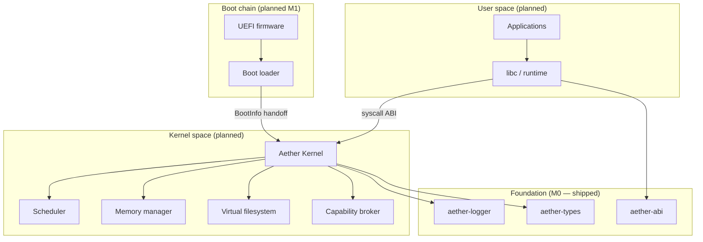

# Aether OS Architecture

This document describes the **design intent** for Aether OS at milestone M0.
Nothing in this document implies that boot, scheduling, memory management, or
security enforcement is implemented unless explicitly marked as shipped.

## Overview

Aether OS is a security-first, Rust-native operating system targeting **x86_64**
with a **UEFI** boot path. The kernel follows a **modular monolithic** model:
subsystems live in one privileged address space but are organized as explicit
modules with documented boundaries.



## Supported hardware

| Tier | Platform | Status | Notes |
|------|----------|--------|-------|
| **Tier 1 (dev)** | QEMU `qemu-system-x86_64` + OVMF (UEFI) | Planned M1 | Primary development and CI boot target |
| **Tier 2 (experimental)** | Real PC, UEFI, x86_64 | Not tested | Supported in principle; no compatibility guarantees until hardware matrix entries are verified |

See [docs/hardware/README.md](docs/hardware/README.md) for the compatibility matrix template and QEMU entry.

## Boot architecture

**Status:** design intent — not bootable in M0.

1. UEFI firmware loads `EFI/BOOT/BOOTX64.EFI` from a FAT32 ESP.
2. The boot loader locates `aether/kernel.elf`, collects the UEFI memory map, and constructs a fixed **`BootInfo`** handoff structure (planned in `aether-types`).
3. The boot loader calls `ExitBootServices` and jumps to the kernel entry point.
4. The kernel initializes architecture-specific state (GDT, IDT, serial), then enters `kmain()`.

See [ADR-0006](docs/adr/ADR-0006-boot-architecture.md) and [ADR-0003](docs/adr/ADR-0003-initial-target-hardware.md).

## Kernel architecture (modular monolithic)

**Status:** stub crate only in M0; subsystems are planned.

| Module | Responsibility | Milestone |
|--------|----------------|-----------|
| `arch/` | CPU, interrupts, context switch | M1–M3 |
| `mm/` | Physical frames, page tables, mappings | M2 |
| `sched/` | Tasks, preemption, syscalls | M3–M4 |
| `fs/` | VFS and initial tmpfs/devfs backends | M5 |
| `cap/` | Capability table and delegation (design) | post-M4 |

Subsystems communicate via ordinary Rust module boundaries today; future isolation may move selected drivers to user space without changing the overall monolithic model (see [ADR-0001](docs/adr/ADR-0001-modular-monolithic-kernel.md)).

## Memory model (design)

**Status:** types defined in `aether-types`; allocator and page tables are **not implemented**.

- **Physical addresses:** `PhysicalAddress` — frame-granular physical memory.
- **Virtual addresses:** `VirtualAddress` — higher-half kernel layout planned at `0xFFFF_8000_0000_0000`; user space below `0x0000_8000_0000_0000`.
- **Pages:** 4 KiB base pages; optional 2 MiB huge pages for kernel mappings.
- **Physical allocator:** bitmap or buddy over UEFI free pages (M2).
- **Virtual memory:** four-level x86_64 page tables (PML4 → PDPT → PD → PT).

## Process model (design)

**Status:** not implemented.

Each process (planned) will own:

- A page-table root (user mappings),
- Kernel and user stacks,
- A `TaskControlBlock` holding saved register state,
- A capability set governing accessible kernel objects.

Scheduling intent: preemptive, priority-aware round-robin driven by APIC timer interrupts (M3). M1 may begin with cooperative yield via a `Yield` syscall stub.

## Security model

**Status:** policy and types only; enforcement is **not yet implemented**.

Aether OS is being designed around:

- **Capability-oriented access control** — rights to objects (files, devices, memory regions) are unforgeable tokens, not ambient authority (see [ADR-0004](docs/adr/ADR-0004-capability-security-model.md)).
- **Least privilege** — processes receive minimal capabilities at spawn; delegation is explicit and auditable.
- **Memory safety** — Rust in shared crates with `#![forbid(unsafe_code)]`; kernel `unsafe` requires documented invariants.
- **Signed atomic updates** — OS updates delivered as verified, atomic images (planned; see Update strategy).

See [SECURITY.md](SECURITY.md) for the threat model and vulnerability reporting process.

## Syscall strategy

**Status:** ABI scaffold in `aether-abi`; dispatch and kernel handlers are **planned**.

- Small, explicit, versioned syscall set defined in one crate (`aether-abi`).
- x86_64 calling convention: syscall number in `rax`, arguments in `rdi`, `rsi`, `rdx`, `r10`, `r8`, `r9`; return in `rax`.
- Unknown or disallowed syscalls fail closed with a defined error code.
- User/kernel boundary validation on all pointer arguments (planned M4).

See [ADR-0005](docs/adr/ADR-0005-syscall-abi-strategy.md).

## Filesystem strategy

**Status:** planned — no VFS in M0.

- **VFS layer** — uniform inode/dentry interface with pluggable backends.
- **Initial backends (planned):** tmpfs (early root, `/tmp`), devfs (`/dev/serial`, `/dev/null`).
- **On-disk filesystem** — deferred (ext2 or custom simple FS under evaluation post-M5).
- **Boot artifacts** — kernel and boot loader on ESP; early root populated in memory by init.

## Update strategy

**Status:** planned — not implemented.

Design intent:

1. Release artifacts are **cryptographically signed** by project maintainers.
2. Updates apply **atomically** (A/B partition or equivalent) with rollback on verification failure.
3. Public keys are pinned in the boot chain verification path (boot loader → kernel policy module).

Details will be specified in a future ADR once M1 boot and image layout exist.

## Repository layout

```
.
├── boot/           # UEFI boot loader (M1)
├── kernel/         # Kernel crate (M0 stub, M1 entry)
├── crates/         # Shared libraries (types, ABI, logger)
├── user/           # User-space programs (future)
├── system/         # Init, daemons, default config (future)
├── drivers/        # Driver sources (future; may start in-kernel)
├── libs/           # User-space libraries (future)
├── tools/          # Host build and development tools
├── tests/          # Integration and QEMU tests (future)
├── docs/
│   ├── adr/        # Architecture Decision Records
│   └── hardware/   # Hardware compatibility matrix
└── scripts/        # Build helpers
```

## Architecture Decision Records

Significant decisions are recorded under [docs/adr/](docs/adr/). The consolidated early decisions document remains at [docs/architecture/001-initial-decisions.md](docs/architecture/001-initial-decisions.md) for historical reference.

## Related documents

- [README.md](README.md) — build, test, and roadmap
- [SECURITY.md](SECURITY.md) — threat model and disclosure
- [CONTRIBUTING.md](CONTRIBUTING.md) — development workflow
- [GOVERNANCE.md](GOVERNANCE.md) — project governance
