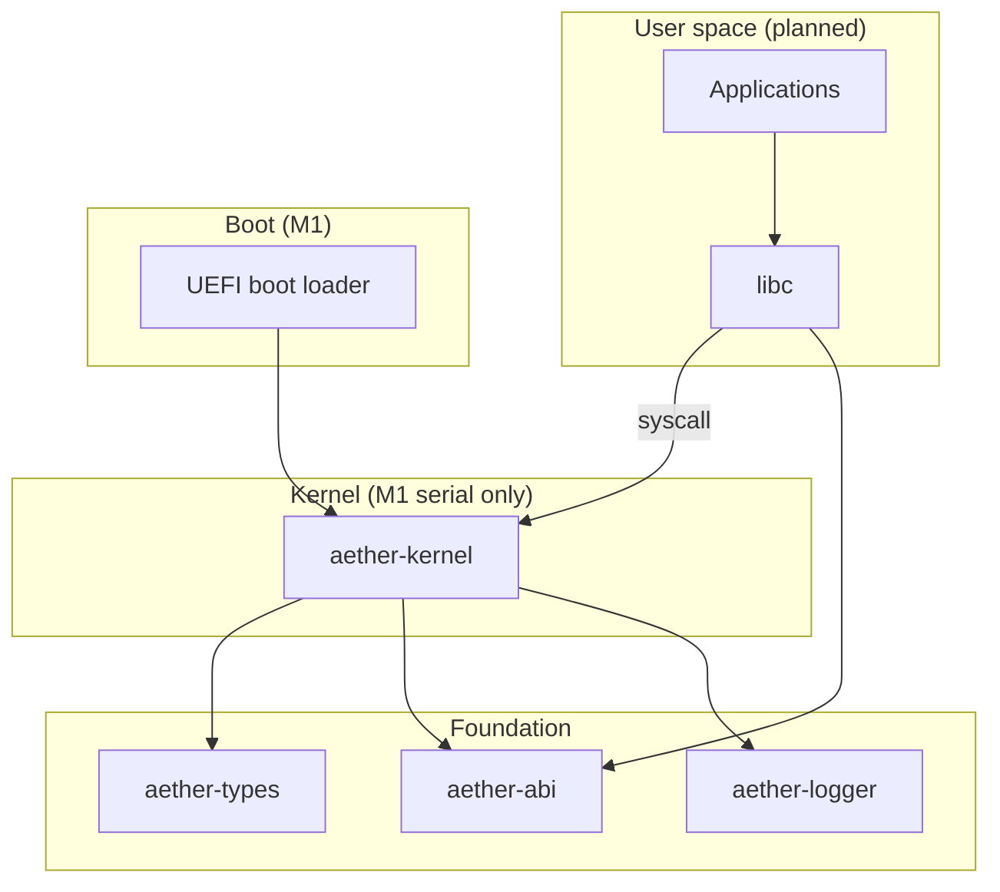

# Aether OS

A security-first, Rust-native operating system for **x86_64**, bootable via **UEFI**.
M1 delivers a minimal UEFI boot path, bare-metal kernel entry, and serial output in QEMU.

## Why Aether OS?

- **Security-first design** — capability-oriented access control and least privilege (design intent; see [SECURITY.md](SECURITY.md)).
- **Memory safety** — Rust with `#![forbid(unsafe_code)]` in shared crates; kernel `unsafe` requires documented invariants.
- **Explicit architecture** — numbered ADRs, threat model, and honest milestone tracking.
- **Stable syscall ABI** — numbers and register layouts in `aether-abi` (scaffold only until M4).

## Current status (M1)

| Capability | Status |
|------------|--------|
| Workspace and shared crates | Shipped |
| UEFI boot loader (`aether-boot`) | Shipped |
| Bare-metal kernel entry + serial | Shipped |
| QEMU boot (serial smoke test) | Verified when QEMU + OVMF installed |
| Physical / virtual memory manager | Planned M2 |
| Scheduler / syscalls | Planned M3–M4 |

**What works:** Build `BOOTX64.EFI` + `kernel.elf`, assemble a FAT ESP, boot under QEMU + OVMF, and print `Aether OS kernel started` on serial.

**What does not work yet:** Real PC hardware boot (untested), full UEFI memory-map handoff, GDT/IDT, paging, heap, or user space.

## Architecture

See [ARCHITECTURE.md](ARCHITECTURE.md) for kernel layout, memory/process models (design),
boot chain, and filesystem/update strategies.

Architecture Decision Records: [docs/adr/](docs/adr/)



## Repository layout

```
.
├── boot/                  # UEFI boot loader (aether-boot)
├── kernel/                # aether-kernel crate
├── crates/
│   ├── aether-types/      # Addresses, BootInfo, errors
│   ├── aether-abi/        # Syscall ABI
│   └── aether-logger/     # Structured logging
├── scripts/               # build-boot, run-qemu
├── tests/                 # QEMU integration smoke test
├── docs/
│   ├── adr/               # Architecture Decision Records
│   └── hardware/          # Hardware compatibility matrix
└── .github/workflows/     # CI
```

## Prerequisites

- **Rust 1.85.0** — via [rust-toolchain.toml](rust-toolchain.toml) (`rust-src` required for kernel `build-std`)
- **rustfmt** and **clippy**
- **QEMU** (`qemu-system-x86_64`) and **OVMF** — for `make run` / QEMU smoke test
- **GNU Make** or **PowerShell**

### Windows (PowerShell)

```powershell
.\scripts\build-boot.ps1          # BOOTX64.EFI + kernel.elf → build/esp/
.\scripts\run-qemu.ps1            # Boot in QEMU (requires OVMF)
.\scripts\build.ps1 check         # fmt, clippy, test, build
```

### Unix / Make

```bash
make run                          # runs scripts/run-qemu.sh
bash scripts/build-boot.sh
make test
```

## Build and boot

### Cross targets

```bash
rustup target add x86_64-unknown-uefi x86_64-unknown-none
```

### Boot loader + kernel

```powershell
.\scripts\build-boot.ps1
```

This produces:

- `build/esp/EFI/BOOT/BOOTX64.EFI`
- `build/esp/aether/kernel.elf`

Bare-metal kernel build uses `RUSTC_BOOTSTRAP=1` and `-Z build-std=core,compiler_builtins`.

### QEMU + OVMF

Install QEMU and OVMF, then place firmware files under `ovmf/` **or** use system paths:

| File | Common locations |
|------|------------------|
| `OVMF_CODE.fd` | `ovmf/`, `/usr/share/OVMF/`, `%ProgramFiles%\qemu\share\` |
| `OVMF_VARS.fd` | same |

```powershell
.\scripts\run-qemu.ps1
```

Serial output is written to `build/qemu-serial.log`. The smoke test passes when the log contains `Aether OS kernel started`.

Run the integration test (ignored by default in CI quality gate):

```bash
cargo test -p aether-integration-tests -- --ignored
```

### Host workspace checks

```bash
cargo fmt --all -- --check
cargo clippy --workspace --all-targets -- -D warnings
cargo test --workspace
cargo build --workspace
```

## Roadmap

| Milestone | Scope | Status |
|-----------|-------|--------|
| **M0** | Foundation, docs, ADRs, shared crates, CI | Shipped |
| **M1** | UEFI boot, minimal kernel, serial, QEMU boot | **Current** |
| **M2** | Physical/virtual memory | Planned |
| **M3** | Scheduler, preemption | Planned |
| **M4** | Syscall dispatch | Planned |
| **M5** | VFS (tmpfs, devfs) | Planned |
| **M6** | User init, shell | Planned |

## Contributing

See [CONTRIBUTING.md](CONTRIBUTING.md). Governance: [GOVERNANCE.md](GOVERNANCE.md).
Code of conduct: [CODE_OF_CONDUCT.md](CODE_OF_CONDUCT.md).

## Security

See [SECURITY.md](SECURITY.md) for the threat model and vulnerability reporting.

## License

[MIT License](LICENSE)
