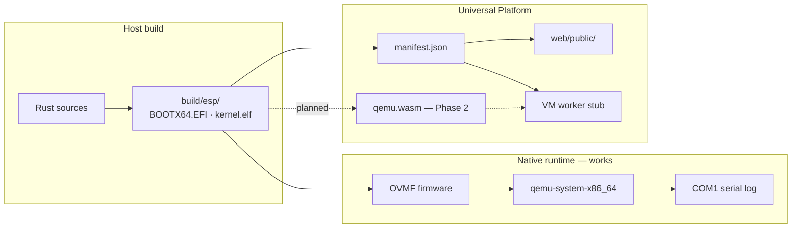
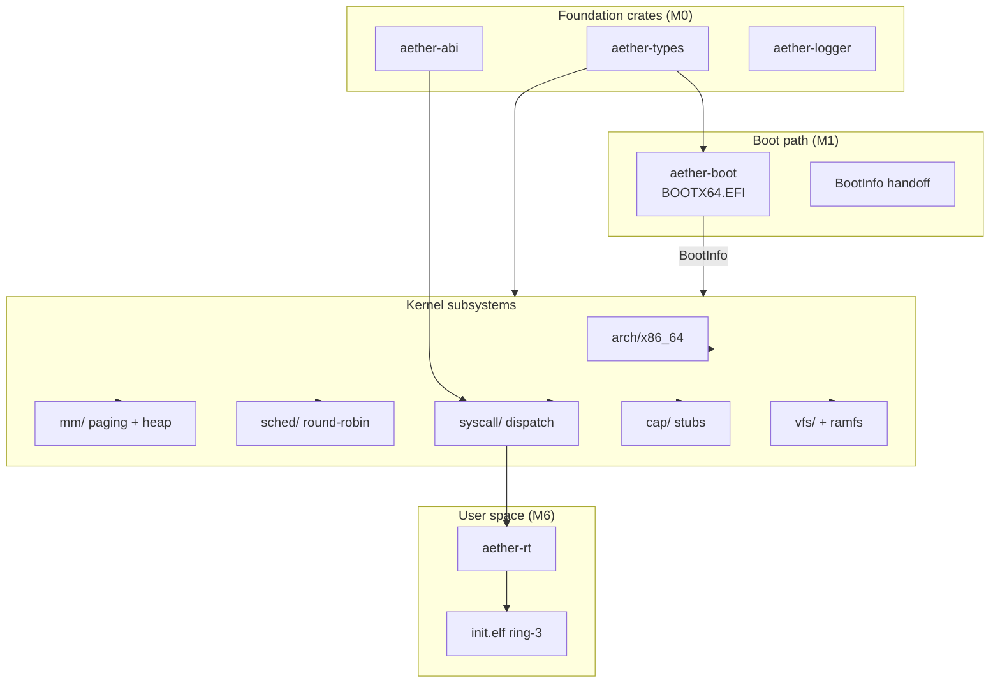
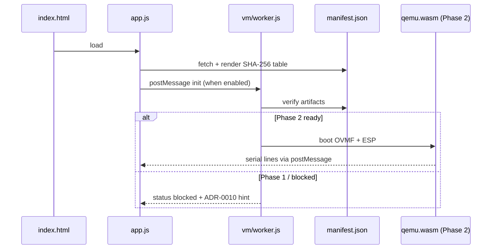
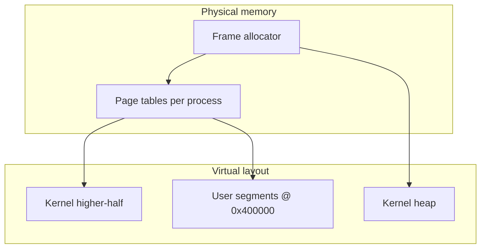

<pre align="center">
╔══════════════════════════════════════════════════════════════════════════════╗
║                                                                              ║
║     ░▒▓█ A E T H E R   O S █▓▒░                                             ║
║     ─────────────────────────────                                            ║
║     security-first kernel · evidence-driven milestones · universal platform  ║
║                                                                              ║
╚══════════════════════════════════════════════════════════════════════════════╝
</pre>

<p align="center">
  <a href="https://github.com/D1bakar/ather-os/actions/workflows/ci.yml"></a>
  <a href="https://github.com/D1bakar/ather-os/actions/workflows/pages.yml"></a>
  <a href="LICENSE"></a>
  <a href="rust-toolchain.toml"></a>
  <a href="docs/ROADMAP.md"></a>
  <a href="https://d1bakar.github.io/ather-os/"></a>
</p>

<p align="center">
  <strong>A research-grade x86_64 operating system</strong> built in Rust under UEFI,<br>
  with a parallel <strong>Universal Platform</strong> that ships the same boot artifacts to browsers — honestly labeled.
</p>

<p align="center">
  <a href="https://d1bakar.github.io/ather-os/"><strong>Live web demo</strong></a>
  ·
  <a href="#try-locally">Try locally</a>
  ·
  <a href="docs/ROADMAP.md">Roadmap</a>
  ·
  <a href="docs/adr/">Architecture decisions</a>
</p>

---

## Table of contents

- [Vision](#vision)
- [Two products, one artifact chain](#two-products-one-artifact-chain)
- [Status at a glance](#status-at-a-glance)
- [Architecture deep-dive](#architecture-deep-dive)
- [Boot sequence walkthrough](#boot-sequence-walkthrough)
- [Memory model](#memory-model)
- [Security philosophy](#security-philosophy)
- [Scheduler & syscalls](#scheduler--syscalls)
- [Try locally (QEMU)](#try-locally-qemu)
- [Try the web platform](#try-the-web-platform)
- [Build from source](#build-from-source)
- [Testing](#testing)
- [Roadmap](#roadmap)
- [Contributing](#contributing)
- [License](#license)

---

## Vision

Aether OS is an experiment in **building a general-purpose kernel where security constraints are decided before features ship** — not retrofitted after a CVE mailing list grows long enough to need its own RSS feed.

We treat the repository as **systems research infrastructure**:

- Every significant design choice is an [Architecture Decision Record](docs/adr/README.md).
- Every milestone closes on **evidence**: COM1 serial strings, host integration tests, or QEMU smoke logs — not slide decks.
- The web delivery path serves **identical** `BOOTX64.EFI` and `kernel.elf` files with SHA-256 checksums. We rejected fake desktop UIs and parallel BIOS boot chains that would fork the kernel for demos ([ADR-0010](docs/adr/ADR-0010-browser-vm-architecture.md)).

> *"Ship what you can prove. Label what you cannot."*
> — Aether engineering principle #1

This is **not** a daily-driver OS, a consumer product, or a browser toy that pretends to boot. It is a disciplined foundation for exploring capability-oriented access control, `#![no_std]` kernel design, and artifact integrity across native and web runtimes.

---

## Two products, one artifact chain

| Surface | What it is | Verified runtime today |
|---------|------------|------------------------|
| **Aether OS** | Rust kernel + UEFI boot loader + user runtime | `qemu-system-x86_64` + OVMF → COM1 serial |
| **Aether Web (Universal Platform)** | Static manifest + in-browser UEFI boot via qemu.wasm | Browser boots real artifacts when OVMF is bundled (GitHub Pages CI) |

Both surfaces consume artifacts from the same ESP build pipeline (`build/esp/`). The web path does not substitute different binaries for convenience.



---

## Status at a glance

### Milestone progress

```
M0 ██████████  Foundation & CI
M1 ██████████  UEFI boot + kernel entry
M2 ██████████  GDT / IDT / PIC / PIT
M3 ██████████  Paging + kernel heap
M4 ██████████  Scheduler + preemption
M5 ██████████  SYSCALL + capability stubs
M6 ██████████  VFS, ring-3 init, fd syscalls
M6.1 ████████░░  QEMU-verified ring-3 boot
Web P1 ██████████  Manifest + landing (shipped)
Web P2 ░░░░░░░░░░  In-browser boot (blocked)
M7+ ░░░░░░░░░░  Networking, graphics, updates…
```

### Honest capability matrix

| Capability | Status | Evidence |
|------------|--------|----------|
| UEFI boot under QEMU + OVMF | **Shipped** | `Aether OS kernel started` on COM1 |
| Round-robin scheduler + PIT preemption | **Shipped** | Host tests + serial markers |
| Per-process page tables + ELF64 loader | **Shipped** | Ring-3 init in QEMU |
| Ramfs + `open`/`read`/`write`/`close` syscalls | **Shipped** | Integration tests |
| Ring-3 init process (`Aether init started`) | **Shipped (M6.1)** | CI optional QEMU job |
| Web manifest + artifact checksums | **Shipped (Phase 1)** | [Live demo](https://d1bakar.github.io/ather-os/) |
| In-browser UEFI boot | **Blocked (Phase 2)** | Requires qemu.wasm + OVMF preload |
| Real PC hardware boot | **Untested** | No hardware matrix pass yet |
| Networking, framebuffer, signed updates | **Planned** | Scaffolds only where noted |

<details>
<summary><strong>What we explicitly do not claim</strong></summary>

- There is **no fake OS desktop** in the browser.
- v86 / SeaBIOS **cannot** load our `BOOTX64.EFI` boot chain.
- Timer preemption of ring-3 user tasks is **not** implemented.
- APIC timer migration from legacy PIC is **not** done.
- Production-grade capability enforcement beyond M5 stubs is **not** shipped.

</details>

---

## Architecture deep-dive

Aether is organized as a Cargo workspace: shared ABI crates, a `#![no_std]` kernel, a UEFI boot loader, user runtime, and host-side tooling.



**Further reading:** [ARCHITECTURE.md](ARCHITECTURE.md) · [docs/architecture/README.md](docs/architecture/README.md) · [docs/adr/](docs/adr/)

<details>
<summary><strong>Web VM architecture (Phase 1 vs Phase 2)</strong></summary>

Phase 1 (shipped) publishes artifacts and a Web Worker stub that validates manifest reachability and reports honest blocked status.

Phase 2 (planned) integrates [qemu.wasm](https://github.com/ktock/qemu-wasm) to run OVMF + ESP inside the browser, bridging `-serial stdio` to the landing page — **real** COM1 output, not a simulated shell.



See [ADR-0010](docs/adr/ADR-0010-browser-vm-architecture.md) and [web-threat-model.md](docs/security/web-threat-model.md).

</details>

---

## Boot sequence walkthrough

### Boot timeline (QEMU + OVMF)

```
  power-on
     │
     ▼
  OVMF firmware ──────────────── finds BOOTX64.EFI on FAT32 ESP
     │
     ▼
  aether-boot (UEFI) ─────────── loads kernel.elf, builds BootInfo
     │
     ▼
  aether-kernel entry ────────── serial banner, arch init
     │
     ├── mm::init ─────────────── frame allocator, paging, heap
     ├── GDT / IDT / PIC / PIT ── timer IRQ wired
     ├── sched::init ──────────── idle + worker threads
     ├── syscall::init ────────── SYSCALL MSR, dispatch table
     ├── mount ramfs ──────────── VFS at /
     └── spawn init.elf ───────── ring-3 via IRETQ
              │
              ▼
         "Aether init started" ─── M6.1 evidence on COM1
```

<details>
<summary><strong>Serial markers we expect (M6.1 smoke)</strong></summary>

```
Aether OS M6: userland started
Aether init started
```

These strings are asserted in `tests/qemu_boot.rs` and checked by `scripts/run-qemu.ps1` / `run-qemu.sh`.

</details>

---

## Memory model



- **M3 shipped:** frame allocator, paging bootstrap, kernel heap.
- **M6 shipped:** per-process page tables with kernel higher-half sharing; ELF64 loader maps user segments.
- **Planned:** demand paging, COW, user stack guard pages, NUMA awareness — design only until milestone opens.

> *"Every userspace pointer crossing the syscall boundary is suspect until validated."*
> — Aether engineering principle #2

---

## Security philosophy

Security is modeled **before** features scale. Capability-oriented access control, least privilege, and fail-closed syscall dispatch are design constraints recorded in [ADR-0004](docs/adr/ADR-0004-capability-security-model.md) and the [threat model](docs/security/threat-model.md).

| Principle | Implementation status |
|-----------|-------------------------|
| Memory safety in shared crates | `#![forbid(unsafe_code)]` in `crates/` |
| Documented kernel `unsafe` | Bare-metal arch/mm with explicit invariants |
| Stable syscall ABI | `aether-abi` — frozen per [ADR-0005](docs/adr/ADR-0005-syscall-abi.md) |
| Capability enforcement | Stubs shipped M5; full broker planned |
| Reproducible builds | Pinned toolchain, CI gates, local parity scripts |
| Web artifact integrity | SHA-256 manifest; no unsigned remote boot |

Report vulnerabilities privately: **security@aether-os.dev** — see [SECURITY.md](SECURITY.md).

<details>
<summary><strong>Web delivery threat model (summary)</strong></summary>

- Artifacts are static files; integrity is client-side SHA-256 verification against `manifest.json`.
- OVMF firmware is **not** bundled in-repo (license/size); future Phase 2 will document fetch/preload policy.
- The landing page does not execute boot artifacts until an explicit emulator integration exists — no drive-by kernel execution.

Full analysis: [docs/security/web-threat-model.md](docs/security/web-threat-model.md).

</details>

---

## Scheduler & syscalls

**M4 shipped:** round-robin kernel-thread scheduler with idle + worker threads, voluntary `yield`, and PIT timer preemption on the legacy PIC path.

**M5 shipped:** `SYSCALL`/`SYSRET` via IA32_STAR/LSTAR/FMASK; dispatch table validation; userspace pointer checks; capability table stubs.

**M6 shipped syscalls:** `write`, `read`, `open`, `close`, `exit`, `yield`, `getpid`.

<details>
<summary><strong>Context switch invariants (M4)</strong></summary>

- Assembly in `kernel/src/arch/x86_64/switch.rs` saves callee-saved GPRs, `RSP`, `RIP`, and `CR3`.
- Timer IRQ sends EOI before `sched::tick_preempt()`.
- Full interrupt-frame save for user tasks remains documented follow-up work.

</details>

---

## Try locally (QEMU)

The **only verified execution environment** for the full boot chain is QEMU with OVMF. Serial output on COM1 is ground truth.

**Linux / macOS:**

```bash
make setup          # once: bash scripts/setup-dev.sh
make boot           # BOOTX64.EFI + kernel.elf + embedded init.elf
make run            # smoke → build/qemu-serial.log
```

**Windows (PowerShell):**

```powershell
.\scripts\setup-dev.ps1
.\scripts\build-boot.ps1
.\scripts\run-qemu.ps1
# Serial log: build/qemu-serial.log
```

---

## Try the web platform

**Live demo (GitHub Pages):** https://d1bakar.github.io/ather-os/

Click **BOOT AETHER** to run the same `BOOTX64.EFI` + `kernel.elf` inside browser QEMU ([qemu.wasm](https://github.com/ktock/qemu-wasm)). Serial output is live COM1 — no fake shell. **No GUI yet** (framebuffer is a future milestone).

**Honest limitations:**

| Topic | Status |
|-------|--------|
| Serial boot in browser | **Works** on desktop Chrome/Edge/Firefox (after ~300 MB WASM download) |
| Mobile browsers | **Experimental** — memory and wasm64 limits may block boot |
| Mouse / desktop GUI | **Not shipped** — serial only |
| OVMF firmware | Bundled by CI from `ovmf` package (~8 MB); not committed to git |
| Emulator binary | Lazy-loaded from [ktock/qemu-wasm-demo CDN](https://github.com/ktock/qemu-wasm-demo) (GPL-2.0) |

**One command from repository root:**

```powershell
# Windows
.\web\serve.ps1
```

```bash
# Linux / macOS
chmod +x web/serve.sh
./web/serve.sh
```

**Manual steps:**

```powershell
.\scripts\build-boot.ps1
.\scripts\build-web-artifacts.ps1
cd web
npm install
npm run serve
```

Open http://localhost:8080 — click **BOOT AETHER** (requires OVMF installed locally for `browser_runtime.status=ready` in manifest).

| Path | Status |
|------|--------|
| Local QEMU + OVMF | **Works** — M6.1 ring-3 init |
| Web manifest + boot UI | **Works** |
| GitHub Pages deploy | **Automated** — push to `main` |
| In-browser UEFI boot | **Works** when OVMF bundled (CI deploy) |

---

## Build from source

| Component | Requirement |
|-----------|-------------|
| Rust | 1.85.0 ([rust-toolchain.toml](rust-toolchain.toml)) |
| Targets | `x86_64-unknown-uefi`, `x86_64-unknown-none` |
| Components | `rustfmt`, `clippy`, `rust-src`, `llvm-tools-preview` |
| QEMU (boot test) | `qemu-system-x86_64` + OVMF |
| Node.js (web serve) | 18+ for `npm run serve` |

Install prerequisites: [docs/INSTALL.md](docs/INSTALL.md)

```bash
# Full local CI gate
bash scripts/ci-check.sh
# Windows: .\scripts\ci-check.ps1
```

Developer guide: [docs/development/getting-started.md](docs/development/getting-started.md) · Build reference: [docs/BUILD.md](docs/BUILD.md)

---

## Testing

| Layer | Command | What it proves |
|-------|---------|----------------|
| Host unit/integration | `cargo test --workspace` | GDT/IDT math, scheduler, VFS, syscall validation |
| Format + lint | `scripts/ci-check.ps1` | fmt, clippy, `-D warnings` |
| QEMU smoke (optional) | `scripts/run-qemu.ps1` | End-to-end boot + M6.1 serial strings |
| Web manifest | `scripts/build-web-artifacts.ps1` | Artifact copy + SHA-256 manifest generation |

Strategy details: [tests/README.md](tests/README.md)

---

## Roadmap

Honest ledger — **Shipped** means CI or QEMU evidence unless noted.

| Milestone | Scope | Status |
|-----------|-------|--------|
| **M0** | Workspace, ADRs, CI, shared crates | **Shipped** |
| **M1** | UEFI boot loader, kernel entry, serial, QEMU smoke | **Shipped** |
| **M2** | GDT, IDT, 8259 PIC, PIT timer | **Shipped** |
| **M3** | Frame allocator, paging, kernel heap | **Shipped** |
| **M4** | Scheduler, preemption, context switch | **Shipped** |
| **M5** | `SYSCALL`/`SYSRET`, dispatch validation, capability scaffold | **Shipped** |
| **M6** | VFS (ramfs), per-process page tables, ring-3 init, fd syscalls | **Shipped** |
| **M6.1** | QEMU-verified ring-3 boot | **Shipped** |
| **Web P1** | Manifest pipeline, landing page, VM stub | **Shipped** |
| **Web P2** | In-browser boot via qemu.wasm + serial bridge | **Planned** |
| **M7** | Networking, socket syscalls | Planned |
| **M8** | Framebuffer, keyboard input | Planned |
| **M9–M10** | Packaging, signed atomic updates | Scaffold only |

Full definitions: [docs/ROADMAP.md](docs/ROADMAP.md)

---

## Contributing

Contributions welcome. Read [CONTRIBUTING.md](CONTRIBUTING.md) and [CODE_OF_CONDUCT.md](CODE_OF_CONDUCT.md). Significant design changes require an [Architecture Decision Record](docs/adr/README.md).

<details>
<summary><strong>Documentation index</strong></summary>

| Document | Description |
|----------|-------------|
| [ARCHITECTURE.md](ARCHITECTURE.md) | System design — shipped vs planned |
| [docs/ROADMAP.md](docs/ROADMAP.md) | Milestone plan M0–M10 + web phases |
| [docs/adr/ADR-0010-browser-vm-architecture.md](docs/adr/ADR-0010-browser-vm-architecture.md) | Universal Platform browser VM |
| [docs/BUILD.md](docs/BUILD.md) | Build targets, cross-compilation |
| [docs/INSTALL.md](docs/INSTALL.md) | Developer environment |
| [docs/security/threat-model.md](docs/security/threat-model.md) | Full threat model |
| [web/README.md](web/README.md) | Universal Platform web scaffold |
| [CHANGELOG.md](CHANGELOG.md) | Release history |

</details>

---

## License

[MIT License](LICENSE) — Copyright (c) 2026 Aether OS Contributors.

---

<p align="center">
  <sub>
    <a href="https://d1bakar.github.io/ather-os/">Live demo</a>
    ·
    <a href="https://github.com/D1bakar/ather-os">GitHub</a>
    ·
    <a href="docs/ROADMAP.md">Roadmap</a>
    ·
    <a href="docs/adr/ADR-0010-browser-vm-architecture.md">ADR-0010</a>
    ·
    <a href="web/public/about.html">About</a>
    ·
    <a href="SECURITY.md">Security</a>
  </sub>
</p>

<!-- Placeholder: animated boot GIF can be added to docs/assets/ when screen capture pipeline exists -->
<!--  -->
