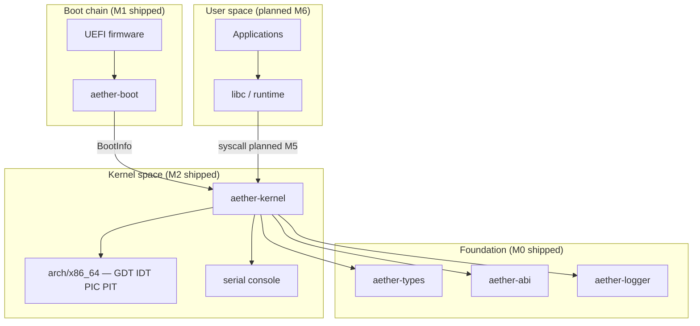

# Aether OS

[](https://github.com/D1bakar/ather-os/actions/workflows/ci.yml)
[](LICENSE)
[](rust-toolchain.toml)
[](docs/ROADMAP.md)

**Aether OS** is a security-first, Rust-native operating system for **x86_64**, bootable via **UEFI**.
The project is in **early development**. M4 delivers a round-robin kernel scheduler with preemptive
timer ticks, context switching, and idle + worker kernel threads under QEMU. User mode and syscalls
remain planned for M5+.

> **Honest status:** This is research and engineering infrastructure, not a daily-driver OS.
> See the [milestone table](#milestones-m0m10) for what is shipped vs planned.

## Why Aether OS?

| Principle | Status |
|-----------|--------|
| **Security-first design** — capability-oriented access control, least privilege | Design intent ([SECURITY.md](SECURITY.md), [ADR-0004](docs/adr/ADR-0004-capability-security-model.md)) |
| **Memory safety** — `#![forbid(unsafe_code)]` in shared crates; documented kernel `unsafe` | Enforced in `crates/` |
| **Explicit architecture** — numbered ADRs, threat model, honest milestone tracking | Shipped (M0) |
| **Stable syscall ABI** — numbers and register layouts in `aether-abi` | Scaffold only until M5 |
| **Reproducible engineering** — pinned toolchain, CI gates, local parity scripts | Shipped (M0–M2) |

## Milestones (M0–M10)

| Milestone | Scope | Status | Notes |
|-----------|-------|--------|-------|
| **M0** | Workspace, shared crates, ADRs, CI, contributor docs | **Shipped** | `aether-types`, `aether-abi`, `aether-logger` |
| **M1** | UEFI boot loader, bare-metal kernel entry, serial, QEMU smoke | **Shipped** | Real PC hardware **untested** |
| **M2** | GDT, IDT, 8259 PIC, PIT timer, exception diagnostics | **Shipped** | APIC migration planned M4+ |
| **M3** | Physical/virtual memory, page tables, kernel heap | **Shipped** | Host-tested frame allocator; QEMU paging smoke optional |
| **M4** | Scheduler, preemption, context switch, kernel threads | **Shipped** | PIT-driven preemption; APIC timer still planned |
| **M5** | Syscall dispatch, user-mode segments, capability scaffold | Planned | ABI types exist in M0 |
| **M6** | VFS (tmpfs, devfs), user init, minimal shell | Planned | |
| **M7** | Networking stack, socket syscalls | Planned | |
| **M8** | Framebuffer / basic graphics, input (keyboard) | Planned | |
| **M9** | Application packaging, package manager | Planned (host scaffold) | Spec + `system/pkgmgr/` skeleton; no runtime install |
| **M10** | Signed atomic updates, release images, real-hardware tier | Planned (host scaffold) | Spec + `system/updater/` skeleton; no runtime apply |

Full milestone definitions: [docs/ROADMAP.md](docs/ROADMAP.md).

## What works today (M4)

- Build UEFI boot loader (`BOOTX64.EFI`) and bare-metal `kernel.elf`
- Boot under **QEMU + OVMF** with serial output
- Initialize GDT, 256-entry IDT, remapped 8259 PIC, PIT at ~100 Hz
- Physical frame allocator, identity + higher-half paging, kernel heap (M3)
- Round-robin scheduler with idle + worker kernel threads and context switching
- Periodic `[timer] tick N` and `[worker] kernel thread tick` messages on COM1
- Host integration tests for GDT/IDT layout encoding and scheduler queue topology
- CI quality gate (fmt, clippy, tests, cross-target builds)

## What does not work yet

- Real PC hardware boot (untested)
- APIC-based interrupt delivery (legacy PIC + PIT only)
- User-mode processes and live syscall dispatch
- Filesystem, networking, graphics (host-testable scaffolds exist)
- Signed updates or package distribution

## Architecture



Detailed design: [ARCHITECTURE.md](ARCHITECTURE.md) · ADRs: [docs/adr/](docs/adr/) · Subsystem index: [docs/architecture/README.md](docs/architecture/README.md)

## Repository layout

```
.
├── boot/                  # UEFI boot loader (aether-boot) — M1 shipped
├── kernel/                # aether-kernel + arch/x86_64/ — M2 shipped
├── crates/
│   ├── aether-types/      # Addresses, BootInfo, errors
│   ├── aether-abi/        # Syscall ABI scaffold
│   └── aether-logger/     # Structured logging
├── user/                  # User-space programs (future M6)
├── system/                # Init, daemons (future M6)
├── drivers/               # Driver sources (future)
├── scripts/               # build-boot, run-qemu, ci-check, setup-dev
├── tests/                 # QEMU integration + arch layout tests
├── docs/
│   ├── adr/               # Architecture Decision Records
│   ├── ROADMAP.md         # Milestone plan M0–M10
│   ├── BUILD.md           # Build reference
│   ├── INSTALL.md         # Installation guide
│   ├── DEPLOYMENT.md      # Deployment and release
│   ├── hardware/          # Hardware compatibility matrix
│   ├── packages/          # Application packaging spec
│   ├── updates/           # Atomic update architecture
│   └── security/          # Threat model
└── .github/workflows/     # CI and release
```

## Install

See [docs/INSTALL.md](docs/INSTALL.md) for platform-specific prerequisites (Rust, QEMU, OVMF).

**Minimum requirements:**

| Component | Version |
|-----------|---------|
| Rust | 1.85.0 ([rust-toolchain.toml](rust-toolchain.toml)) |
| Targets | `x86_64-unknown-uefi`, `x86_64-unknown-none` |
| Components | `rustfmt`, `clippy`, `rust-src`, `llvm-tools-preview` |
| QEMU (optional) | `qemu-system-x86_64` + OVMF for boot smoke test |

## Quick start

```bash
# One-time setup
make setup          # or: bash scripts/setup-dev.sh

# Build host workspace + boot artifacts
make boot

# Boot in QEMU (serial → build/qemu-serial.log)
make run

# Full CI gate locally
bash scripts/ci-check.sh
```

**Windows (PowerShell):**

```powershell
.\scripts\setup-dev.ps1
.\scripts\build-boot.ps1
.\scripts\run-qemu.ps1
.\scripts\ci-check.ps1
```

**Expected serial output (M2):**

```
Aether OS kernel started
BootInfo OK
Aether OS M2: GDT/IDT/interrupts initialized
[timer] tick 100
[timer] tick 200
...
```

More detail: [docs/BUILD.md](docs/BUILD.md) · [docs/development/getting-started.md](docs/development/getting-started.md)

## Documentation

| Document | Description |
|----------|-------------|
| [ARCHITECTURE.md](ARCHITECTURE.md) | System design — shipped vs planned subsystems |
| [docs/ROADMAP.md](docs/ROADMAP.md) | Milestone plan M0–M10 |
| [docs/BUILD.md](docs/BUILD.md) | Build targets, cross-compilation, CI parity |
| [docs/INSTALL.md](docs/INSTALL.md) | Developer environment installation |
| [docs/DEPLOYMENT.md](docs/DEPLOYMENT.md) | Release artifacts and deployment (future) |
| [docs/hardware/README.md](docs/hardware/README.md) | Hardware compatibility matrix |
| [SECURITY.md](SECURITY.md) | Vulnerability reporting and security policy |
| [docs/security/threat-model.md](docs/security/threat-model.md) | Full threat model |
| [docs/packages/README.md](docs/packages/README.md) | Application packaging specification |
| [docs/updates/README.md](docs/updates/README.md) | Atomic update architecture |
| [CONTRIBUTING.md](CONTRIBUTING.md) | Contribution workflow |
| [GOVERNANCE.md](GOVERNANCE.md) | Project governance |
| [CHANGELOG.md](CHANGELOG.md) | Release history |

## Contributing

Contributions are welcome. Please read [CONTRIBUTING.md](CONTRIBUTING.md) before opening a pull request.
All participants must follow [CODE_OF_CONDUCT.md](CODE_OF_CONDUCT.md).

Significant design changes require an [Architecture Decision Record](docs/adr/README.md).

## Security

Report vulnerabilities privately: **security@aether-os.dev** — do not use public GitHub issues.

See [SECURITY.md](SECURITY.md) and [docs/security/threat-model.md](docs/security/threat-model.md).

## License

[MIT License](LICENSE) — Copyright (c) 2026 Aether OS Contributors.
