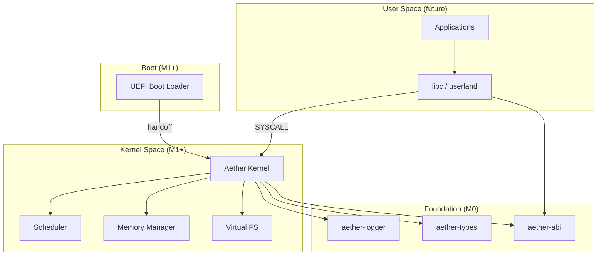

# Aether OS

A modern, Rust-native operating system for x86_64, bootable via UEFI.

Aether OS is designed from the ground up with memory safety, explicit architecture
decision records, and a modular crate layout that separates shared types, the
syscall ABI, and kernel subsystems into well-tested building blocks.

## Why Aether OS?

- **Memory safety**: Written in Rust with `#![forbid(unsafe_code)]` in shared crates;
  kernel code will use targeted `unsafe` with documented invariants.
- **Modern boot path**: UEFI handoff with a clear separation between boot loader and kernel.
- **Stable ABI**: Syscall numbers and register layouts defined in `aether-abi`.
- **Structured logging**: Host-testable logging infrastructure ready for serial output in M1.

## Current Capabilities (M0)

| Capability | Status |
|------------|--------|
| Workspace & crate layout | ✅ |
| Shared types (`aether-types`) | ✅ |
| Syscall ABI (`aether-abi`) | ✅ |
| Structured logger (`aether-logger`) | ✅ |
| CI/CD pipelines | ✅ |
| UEFI boot loader | ⏳ M1 |
| Kernel | ⏳ M1 |
| QEMU run target | ⏳ M1 |

## Architecture



See [docs/architecture/](docs/architecture/) for detailed decision records.

## Repository Layout

```
aether-os/
├── boot/                  # UEFI boot loader (M1)
├── kernel/                # Monolithic kernel (M1)
├── crates/
│   ├── aether-types/      # Shared address, error, page types
│   ├── aether-abi/        # Syscall numbers and register ABI
│   └── aether-logger/     # Structured logging
├── docs/
│   └── architecture/      # Architecture Decision Records
├── scripts/               # Build helpers
├── .github/               # CI, issue templates, PR template
├── Cargo.toml             # Workspace root
├── Makefile               # Build orchestration
└── README.md
```

## Prerequisites

- **Rust 1.85.0** (pinned via `rust-toolchain.toml`)
- **rustfmt** and **clippy** (installed automatically by rustup)
- **QEMU** (required from M1 onward for `make run`)
- **OVMF** UEFI firmware (required from M1 onward)
- **GNU Make** or **NMake** on Windows

## Build

```bash
# Build all workspace crates
make build

# Or directly with Cargo
cargo build --workspace
```

## Run

> **Note**: Boot is not yet implemented. `make run` prints instructions for M1.

```bash
make run
# Expected output: message explaining M1 boot target is required
```

## Test

```bash
make test

# Or directly
cargo test --workspace
cargo clippy --workspace -- -D warnings
cargo fmt --check
```

## Roadmap

| Milestone | Scope | Status |
|-----------|-------|--------|
| **M0** | Repository foundation, shared crates, CI, docs | ✅ Current |
| **M1** | UEFI boot loader, minimal kernel, serial output, QEMU boot | Planned |
| **M2** | Physical memory manager, virtual memory, page tables | Planned |
| **M3** | Process scheduler, context switching | Planned |
| **M4** | Syscall dispatch, basic file I/O | Planned |
| **M5** | Virtual filesystem (tmpfs + devfs) | Planned |
| **M6** | User-space init, shell | Planned |

### M0 Plan

M0 establishes the professional foundation:

- Cargo workspace with `aether-types`, `aether-abi`, `aether-logger`
- Toolchain pinning (`rust-toolchain.toml`, `rustfmt.toml`, `clippy.toml`)
- Makefile with `build`, `run`, `test`, `clean` targets
- GitHub Actions CI (fmt, clippy, test, build)
- Architecture Decision Record ([001-initial-decisions.md](docs/architecture/001-initial-decisions.md))
- Contributing, security, and license policies
- Skeleton `boot/` and `kernel/` directories with M1 placeholders

## Contributing

See [CONTRIBUTING.md](CONTRIBUTING.md) for development workflow, commit conventions,
and code review expectations.

## Security

See [SECURITY.md](SECURITY.md) for vulnerability reporting.

## License

Licensed under the [MIT License](LICENSE).
