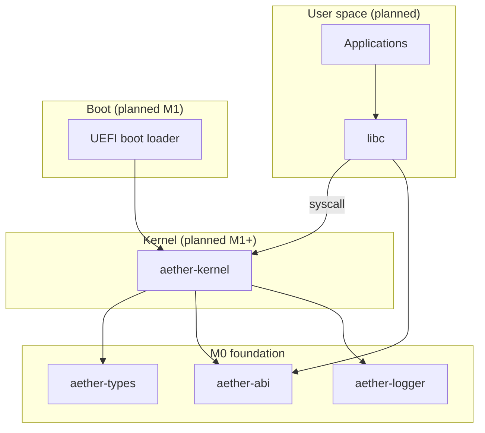

# Aether OS

A security-first, Rust-native operating system for **x86_64**, bootable via **UEFI**
(planned M1). This repository contains the M0 engineering foundation: shared crates,
documentation, architecture decision records, CI, and kernel stubs — **not a
bootable OS yet**.

## Why Aether OS?

- **Security-first design** — capability-oriented access control and least privilege (design intent; see [SECURITY.md](SECURITY.md)).
- **Memory safety** — Rust with `#![forbid(unsafe_code)]` in shared crates; kernel `unsafe` requires documented invariants.
- **Explicit architecture** — numbered ADRs, threat model, and honest milestone tracking.
- **Stable syscall ABI** — numbers and register layouts in `aether-abi` (scaffold only until M4).

## Current status (M0)

| Capability | Status |
|------------|--------|
| Workspace and shared crates | Shipped |
| Kernel stub (`aether-kernel`) | Shipped (host stub; bare metal M1) |
| Documentation and ADRs | Shipped |
| CI (fmt, clippy, test, build) | Shipped |
| UEFI boot loader | Planned M1 |
| Bootable kernel / QEMU run | Planned M1 |

**The OS does not boot.** Do not expect `make run` to launch a working system until M1.

## Architecture

See [ARCHITECTURE.md](ARCHITECTURE.md) for kernel layout, memory/process models (design),
boot chain, and filesystem/update strategies.

Architecture Decision Records: [docs/adr/](docs/adr/)



## Repository layout

```
.
├── boot/                  # UEFI boot loader (M1)
├── kernel/                # aether-kernel crate (M0 stub)
├── crates/
│   ├── aether-types/      # Addresses, errors, page flags
│   ├── aether-abi/        # Syscall ABI
│   └── aether-logger/     # Structured logging
├── user/                  # User programs (future)
├── system/                # System config (future)
├── drivers/               # Drivers (future)
├── libs/                  # User-space libs (future)
├── tools/                 # Host tools
├── tests/                 # Integration tests (future)
├── docs/
│   ├── adr/               # Architecture Decision Records
│   └── hardware/          # Hardware compatibility matrix
├── scripts/               # Build helpers
└── .github/workflows/     # CI
```

## Prerequisites

- **Rust 1.85.0** — installed automatically via [rustup](https://rustup.rs/) and [rust-toolchain.toml](rust-toolchain.toml)
- **rustfmt** and **clippy** — installed with the pinned toolchain
- **GNU Make** or **PowerShell** for build scripts
- **QEMU** and **OVMF** — required from **M1** onward for `make run`

### Windows (PowerShell)

```powershell
.\scripts\build.ps1 check   # fmt, clippy, test, build
.\scripts\build.ps1 build
```

### Unix / Make

```bash
make test    # fmt, clippy, test
make build
```

## Build and test

```bash
cargo fmt --all -- --check
cargo clippy --workspace --all-targets -- -D warnings
cargo test --workspace
cargo build --workspace
```

### Kernel bare-metal build (M1 path — not required for M0 CI)

```bash
rustup target add x86_64-unknown-none
cargo build -p aether-kernel --no-default-features --target x86_64-unknown-none
```

## Roadmap

| Milestone | Scope | Status |
|-----------|-------|--------|
| **M0** | Foundation, docs, ADRs, shared crates, CI | Current |
| **M1** | UEFI boot, minimal kernel, serial, QEMU boot | Next |
| **M2** | Physical/virtual memory | Planned |
| **M3** | Scheduler, preemption | Planned |
| **M4** | Syscall dispatch | Planned |
| **M5** | VFS (tmpfs, devfs) | Planned |
| **M6** | User init, shell | Planned |

## Contributing

See [CONTRIBUTING.md](CONTRIBUTING.md). Governance: [GOVERNANCE.md](GOVERNANCE.md).
Code of conduct: [CODE_OF_CONDUCT.md](CODE_OF_CONDUCT.md).

## Security

See [SECURITY.md](SECURITY.md) for the threat model and vulnerability reporting.

## License

[MIT License](LICENSE)
