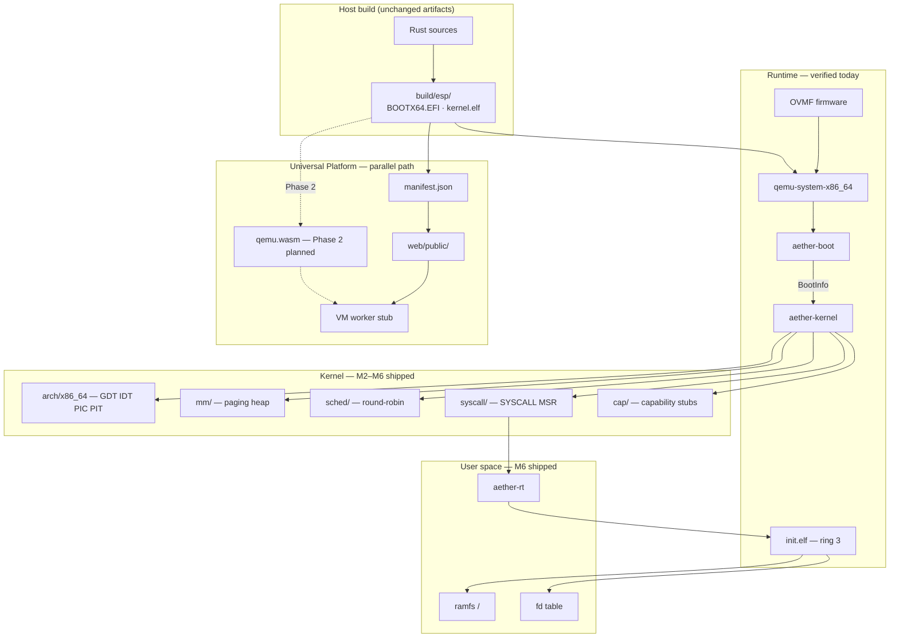

```
    ░▒▓  A E T H E R  ▓▒░
```

[](https://github.com/D1bakar/ather-os/actions/workflows/ci.yml)
[](LICENSE)
[](rust-toolchain.toml)
[](docs/ROADMAP.md)

**A security-first operating system engineered from first principles.**  
Run artifacts in QEMU today · Browser platform in development

---

Aether OS is a Rust-native **x86_64 UEFI** kernel with capability-oriented security as a design constraint—not a retrofit. The boot chain, syscall ABI, and milestone ledger are documented as numbered Architecture Decision Records; every shipped layer is traceable to CI or QEMU serial evidence. This is research infrastructure: rigorous, auditable, and deliberately incomplete where work remains.

## Try it

### Local boot (verified)

The only runtime that executes Aether today is **QEMU + OVMF**. Serial output on COM1 is the ground truth.

**Linux / macOS:**

```bash
make setup          # once: bash scripts/setup-dev.sh
make boot           # build BOOTX64.EFI + kernel.elf + embedded init.elf
make run            # QEMU smoke → build/qemu-serial.log
```

**Windows (PowerShell):**

```powershell
.\scripts\setup-dev.ps1
.\scripts\build-boot.ps1
.\scripts\run-qemu.ps1
```

**Expected serial markers (M6.1):**

```
Aether OS M6: userland started
Aether init started
```

Ring-3 init via embedded ELF is verified in CI optional QEMU job and local smoke scripts. Real PC hardware boot is **untested**.

### Universal Platform — web Phase 1 (shipped)

The browser delivery scaffold serves **the same ESP artifacts** with SHA-256 manifest metadata. It does **not** boot Aether in the browser yet—Phase 2 is blocked on [qemu.wasm](https://github.com/ktock/qemu-wasm) integration ([ADR-0010](docs/adr/ADR-0010-browser-vm-architecture.md)).

```powershell
.\scripts\build-boot.ps1
.\scripts\build-web-artifacts.ps1
cd web
npm run serve
```

Open http://localhost:8080 — manifest checksums, honest boot status, VM worker stub. No simulated desktop. No fake terminal.

| Path | Status |
|------|--------|
| Local QEMU + OVMF | **Works** — M6.1 ring-3 init |
| Web manifest + landing | **Works** — Phase 1 |
| In-browser UEFI boot | **Blocked** — awaits qemu.wasm (Phase 2) |

## Architecture



**Foundation crates (M0):** `aether-types` · `aether-abi` · `aether-logger`

Detailed design: [ARCHITECTURE.md](ARCHITECTURE.md) · Subsystems: [docs/architecture/README.md](docs/architecture/README.md) · ADRs: [docs/adr/](docs/adr/)

## Milestones

Honest ledger. **Shipped** = CI or QEMU evidence unless noted. **Planned** = design/spec only.

| Milestone | Scope | Status |
|-----------|-------|--------|
| **M0** | Workspace, ADRs, CI, shared crates | **Shipped** |
| **M1** | UEFI boot loader, kernel entry, serial, QEMU smoke | **Shipped** |
| **M2** | GDT, IDT, 8259 PIC, PIT timer | **Shipped** |
| **M3** | Frame allocator, paging, kernel heap | **Shipped** |
| **M4** | Scheduler, preemption, context switch | **Shipped** |
| **M5** | `SYSCALL`/`SYSRET`, dispatch validation, capability scaffold | **Shipped** |
| **M6** | VFS (ramfs), per-process page tables, ring-3 init, fd syscalls | **Shipped** |
| **M6.1** | QEMU-verified ring-3 boot (`Aether init started`) | **Shipped** |
| **Web P1** | Manifest pipeline, landing page, VM stub ([ADR-0010](docs/adr/ADR-0010-browser-vm-architecture.md)) | **Shipped** |
| **Web P2** | In-browser boot via qemu.wasm + serial bridge | **Planned** |
| **M7** | Networking, socket syscalls | Planned |
| **M8** | Framebuffer, keyboard input | Planned |
| **M9** | Application packaging (`system/pkgmgr/` scaffold only) | Planned |
| **M10** | Signed atomic updates (`system/updater/` scaffold only) | Planned |

Full definitions: [docs/ROADMAP.md](docs/ROADMAP.md)

### What works today

- UEFI boot chain under QEMU; COM1 serial diagnostics
- Round-robin kernel scheduler with PIT preemption (legacy PIC path)
- Per-process page tables; ELF64 loader; first ring-3 user process
- Ramfs at `/`; syscalls: `write`, `read`, `open`, `close`, `exit`, `yield`, `getpid`
- Host integration tests for GDT/IDT, scheduler, VFS, syscall validation
- Web artifact manifest with SHA-256 checksums

### What does not work yet

- Real hardware boot (untested)
- APIC timer (PIC + PIT only)
- Timer preemption of ring-3 user tasks
- In-browser UEFI boot (Phase 2 / qemu.wasm)
- Networking, graphics, shell/exec, signed updates at runtime

## Security philosophy

Security is modeled before features ship. Capability-oriented access control, least privilege, and fail-closed syscall dispatch are **design constraints** recorded in [ADR-0004](docs/adr/ADR-0004-capability-security-model.md) and the [threat model](docs/security/threat-model.md).

| Principle | Implementation status |
|-----------|----------------------|
| Memory safety in shared crates | `#![forbid(unsafe_code)]` in `crates/` |
| Documented kernel `unsafe` | Bare-metal arch/mm with explicit invariants |
| Stable syscall ABI | `aether-abi` — numbers and register layouts frozen per ADR-0005 |
| Capability enforcement | Stubs shipped M5; full broker planned |
| Reproducible builds | Pinned toolchain, CI gates, local parity scripts |

Report vulnerabilities privately: **security@aether-os.dev** — see [SECURITY.md](SECURITY.md).

## What makes Aether different

**Capabilities, not ambient authority.** Syscall paths validate userspace pointers and consult per-process capability tables—even as stubs—so the boundary exists before userland grows.

**Evidence-driven milestones.** Each M-number corresponds to verifiable output: serial strings, host tests, or QEMU smoke. The roadmap states *planned* where runtime code does not exist.

**Universal Platform integrity.** The web path serves identical `BOOTX64.EFI` + `kernel.elf` artifacts. We rejected fake OS UIs and parallel BIOS boot chains that would fork the kernel for demos ([ADR-0010](docs/adr/ADR-0010-browser-vm-architecture.md)).

**Rust as systems language, not as marketing.** `#![no_std]` kernel, cross-target builds for `x86_64-unknown-none` and `x86_64-unknown-uefi`, ADR-governed ABI evolution.

## Quick start

| Component | Requirement |
|-----------|-------------|
| Rust | 1.85.0 ([rust-toolchain.toml](rust-toolchain.toml)) |
| Targets | `x86_64-unknown-uefi`, `x86_64-unknown-none` |
| Components | `rustfmt`, `clippy`, `rust-src`, `llvm-tools-preview` |
| QEMU (boot test) | `qemu-system-x86_64` + OVMF |

Install prerequisites: [docs/INSTALL.md](docs/INSTALL.md)

```bash
# Full local CI gate
bash scripts/ci-check.sh
# Windows: .\scripts\ci-check.ps1
```

Developer guide: [docs/development/getting-started.md](docs/development/getting-started.md) · Build reference: [docs/BUILD.md](docs/BUILD.md)

## Documentation

| Document | Description |
|----------|-------------|
| [ARCHITECTURE.md](ARCHITECTURE.md) | System design — shipped vs planned |
| [docs/ROADMAP.md](docs/ROADMAP.md) | Milestone plan M0–M10 + web phases |
| [docs/adr/ADR-0010-browser-vm-architecture.md](docs/adr/ADR-0010-browser-vm-architecture.md) | Universal Platform browser VM |
| [docs/BUILD.md](docs/BUILD.md) | Build targets, cross-compilation |
| [docs/INSTALL.md](docs/INSTALL.md) | Developer environment |
| [docs/DEPLOYMENT.md](docs/DEPLOYMENT.md) | Release artifacts (future) |
| [docs/hardware/README.md](docs/hardware/README.md) | Hardware compatibility matrix |
| [SECURITY.md](SECURITY.md) | Vulnerability reporting |
| [docs/security/threat-model.md](docs/security/threat-model.md) | Full threat model |
| [docs/security/web-threat-model.md](docs/security/web-threat-model.md) | Web artifact delivery |
| [web/README.md](web/README.md) | Universal Platform web scaffold |
| [CONTRIBUTING.md](CONTRIBUTING.md) | Contribution workflow |
| [GOVERNANCE.md](GOVERNANCE.md) | Project governance |
| [CHANGELOG.md](CHANGELOG.md) | Release history |

## Contributing

Contributions welcome. Read [CONTRIBUTING.md](CONTRIBUTING.md) and [CODE_OF_CONDUCT.md](CODE_OF_CONDUCT.md). Significant design changes require an [Architecture Decision Record](docs/adr/README.md).

## License

[MIT License](LICENSE) — Copyright (c) 2026 Aether OS Contributors.

---

<p align="center">
  <sub>
    <a href="https://github.com/D1bakar/ather-os">GitHub</a>
    · <a href="docs/ROADMAP.md">Roadmap</a>
    · <a href="docs/adr/ADR-0010-browser-vm-architecture.md">ADR-0010</a>
    · <a href="web/public/about.html">About</a>
    · <a href="SECURITY.md">Security</a>
  </sub>
</p>
