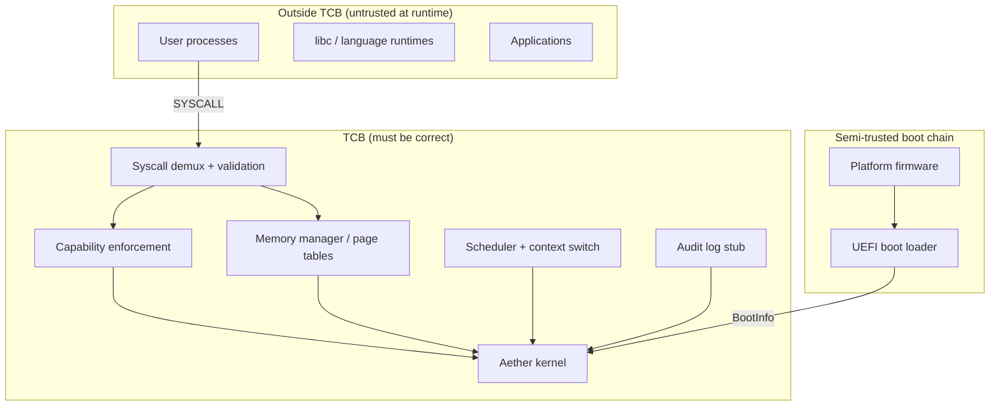

# Security Policy

## Supported versions

| Version | Supported |
|---------|-----------|
| 0.1.x   | Active development (M5 security / syscalls) |

**Important:** Aether OS is in early development. M5 delivers capability enforcement stubs,
syscall pointer validation, audit logging, and secure-by-default policy configuration in
`aether-types` and the kernel. User-mode ring-3 entry and full per-process page-table
isolation remain **planned**. There is **no production user space** yet. Statements below
describe **shipped scaffolding**, **design intent**, and **reporting process** — not full
production guarantees.

## Reporting a vulnerability

**Do not report security vulnerabilities through public GitHub issues.**

Report privately by emailing: **security@aether-os.dev**

Include:

- Description of the vulnerability
- Steps to reproduce
- Potential impact assessment
- Suggested fix (if any)

We aim to acknowledge reports within **48 hours** and provide an initial assessment
within **7 days**. Response times may vary during early development when no production
releases exist.

## Threat model

The full threat model — assets, adversaries, trust boundaries, subsystem-specific threats,
and security principles with honest status markers — is maintained in:

**[docs/security/threat-model.md](docs/security/threat-model.md)**

Summary of current maturity (M5):

| Area | M5 status |
|------|-----------|
| Boot handoff validation | **Partial** — magic/version only |
| Kernel isolation / paging | **Planned** M3 |
| Interrupt / exception handling | **Shipped** — log and halt on unexpected exceptions |
| Syscall boundary enforcement | **Partial** — host-testable dispatch, pointer validation, fail-closed unknown syscalls |
| Capability model | **Partial** — per-process table stub, magic-prefixed ids, rights enforcement |
| Audit logging | **Partial** — in-memory ring buffer stub; no persistence |
| Secure defaults | **Shipped** — `SecurityDefaults::PRODUCTION` in `aether-types` |
| Signed updates | **Planned** M10 (host skeleton in `system/updater/`) |

## Trusted Computing Base (TCB)

The **Trusted Computing Base** is the set of hardware, firmware, and software components
whose correct operation is required for the system's security goals. Everything outside the
TCB is assumed potentially hostile once user space exists.

### TCB boundary diagram

### TCB components (M5)

| Component | Location | TCB role | M5 status |
|-----------|----------|----------|-----------|
| **Syscall demux** | `kernel/src/syscall/` | Validates syscall numbers, user pointers, and capability requirements before handlers run | **Partial** — host-testable; bare-metal MSR entry wired |
| **Pointer validation** | `aether-types/src/user_ptr.rs`, `kernel/src/syscall/validate.rs` | Rejects null, non-canonical, and kernel-range addresses; bounds-checks buffers | **Shipped** (host tests) |
| **Capability table** | `kernel/src/cap/`, `aether-types/src/capability.rs` | Kernel-issued magic-prefixed tokens; per-process table with rights checks | **Partial** — global bring-up table until scheduler wiring |
| **Security defaults** | `aether-types/src/security_config.rs` | Fail-closed policy knobs (`deny_unknown_syscalls`, `validate_user_pointers`, …) | **Shipped** |
| **Audit log** | `kernel/src/security/audit.rs` | Records denied syscalls, forged capabilities, bad pointers | **Partial** — ring buffer only |
| **Shared type safety** | `aether-types`, `aether-abi` | `#![forbid(unsafe_code)]`; single syscall ABI source | **Shipped** |
| **Boot handoff** | `boot/`, `kernel/src/main.rs` | Validates `BootInfo` magic/version at entry | **Partial** |
| **Interrupt handlers** | `kernel/src/arch/x86_64/` | Prevents ambiguous CPU state on exceptions | **Shipped** (M2) |
| **Page tables / W^X** | `kernel/src/mm/` | User/kernel address-space isolation | **Planned** M3 |

### TCB minimization principles

1. **Small syscall surface** — syscall numbers and metadata live in one crate (`aether-abi`);
   the kernel consults `SYSCALL_TABLE` rather than ad hoc switch logic.
2. **Fail closed** — unknown syscalls, forged capabilities, and invalid pointers return
   defined errors; the kernel does not panic on untrusted input.
3. **No ambient authority** — I/O syscalls require explicit capabilities when
   `SecurityDefaults::require_capability_for_io` is active (production default).
4. **Shared validation** — pointer checks are pure functions in `aether-types` so host CI
   exercises the same logic the bare-metal kernel uses.
5. **Auditable denials** — security-relevant rejections are recorded in the audit log stub
   when `audit_denied_access` is enabled.

### Outside the TCB (explicit non-guarantees)

- User-space code, libc, and applications
- QEMU, OVMF, and host development toolchains
- Network stack protocol stubs (`kernel/src/net/`) until capability-gated and fuzz-tested
- Package manager and update apply paths until signature verification ships (M10)

Changes to TCB components require review per [GOVERNANCE.md](GOVERNANCE.md) and should update
[docs/security/threat-model.md](docs/security/threat-model.md).

## Boot architecture (security-relevant)

**Status:** M1 boot path **shipped**; signature verification **not implemented**.

Shipped properties:

- Fixed-layout `BootInfo` with magic and version validation at kernel entry.
- Boot loader exits UEFI boot services before kernel entry.

Planned properties:

- Full validation of memory-map pointers before allocator use (M3).
- Signature verification of `kernel.elf` and update payloads (M10).

See [ARCHITECTURE.md](ARCHITECTURE.md), [docs/security/threat-model.md](docs/security/threat-model.md), and [ADR-0006](docs/adr/ADR-0006-boot-architecture.md).

## Interrupt and exception handling (M2)

**Status:** **shipped** — CPU exceptions log vector to serial and halt; timer IRQ uses PIC EOI discipline.

Security-relevant properties:

- No silent recovery from unexpected exceptions in early milestones.
- Double-fault handler logs and halts (no stack recovery yet).
- Interrupts enabled only after IDT and PIC are configured.

See [ADR-0008](docs/adr/ADR-0008-interrupt-architecture.md).

## Capability model (M5)

**Status:** **partial** — types, per-process table stub, and enforcement in `kernel/src/cap/`.

Shipped properties:

- Kernel-issued capability ids embed [`CAPABILITY_MAGIC`](crates/aether-types/src/capability.rs) — forged tokens rejected.
- Per-process [`CapabilityTable`](kernel/src/cap/mod.rs) grants, checks, and attenuates rights.
- Syscall dispatch consults `aether-abi` metadata for required object type and rights.

Planned properties:

- FD-to-capability mapping for I/O syscalls (currently table-level stub).
- Delegation syscalls and auditable delegation chains.
- Capability broker in dedicated `cap/` subsystem directory.

See [ADR-0004](docs/adr/ADR-0004-capability-security-model.md) and [docs/security/threat-model.md](docs/security/threat-model.md).

## Syscall boundary (M5)

**Status:** **partial** — ABI in `aether-abi`; host-testable dispatch in `kernel/src/syscall/`.

Shipped controls:

- Validate user pointers against canonical user range before handlers run.
- Reject unknown syscall numbers with `ErrorCode::NotSupported` (fail closed).
- Enforce capability requirements from `SYSCALL_TABLE` when `require_capability_for_io` is active.
- Record denials in the audit log stub.

Planned controls:

- Bare-metal user-mode entry (ring 3) with per-process page tables.
- Copy-in/copy-out through validated buffers only.

See [ADR-0005](docs/adr/ADR-0005-syscall-abi-strategy.md).

## Memory model (security-relevant)

**Status:** address/page types in `aether-types`; no allocator or page tables.

Planned properties:

- Separate user and kernel page tables per process.
- No executable writable mappings for user space (W^X intent).
- Kernel mappings not accessible from user mode.

See [ARCHITECTURE.md](ARCHITECTURE.md) and [docs/security/threat-model.md](docs/security/threat-model.md).

## Update and packaging security (design intent)

**Status:** host-testable scaffolds only; no runtime apply or install.

| Component | Path | Security note |
|-----------|------|---------------|
| Update types + verify stub | `system/updater/` | Stub verifier accepts dev fixtures; Ed25519 planned M10 |
| Package manager scaffold | `system/pkgmgr/` | Signature stub; no kernel-mediated install |

Specifications: [docs/updates/README.md](docs/updates/README.md), [docs/packages/README.md](docs/packages/README.md).

## Supported hardware and exposure

| Target | Tier | Security note |
|--------|------|---------------|
| QEMU x86_64 + OVMF | Tier 1 dev | Primary test environment; not a production deployment |
| Real PC hardware | Tier 2 experimental | Untested; firmware and Secure Boot behavior vary |

See [docs/hardware/README.md](docs/hardware/README.md).

## Scope of reports

**In scope:**

- Memory safety violations in project Rust code
- Logic errors in syscall ABI definitions that imply unsafe kernel behavior
- Boot chain flaws in shipped boot loader or kernel entry code
- Interrupt handler bugs causing memory corruption or silent privilege escalation
- CI or release pipeline weaknesses affecting artifact integrity

**Out of scope:**

- Theoretical attacks against unimplemented subsystems without a concrete code path on shipped code
- Issues requiring physical access that Secure Boot is explicitly designed to address later
- Vulnerabilities in QEMU, OVMF, or host Rust toolchain (report upstream)

Details: [docs/security/threat-model.md](docs/security/threat-model.md).

## Disclosure policy

We follow coordinated disclosure. We will work with reporters to understand and fix
issues before public disclosure. Credit will be given unless anonymity is requested.

## Safe harbor

We consider security research conducted in good faith to be authorized. We will not
pursue legal action against researchers who:

- Make a good faith effort to avoid privacy violations and data destruction
- Report vulnerabilities promptly
- Allow reasonable time for remediation before public disclosure

## Related documents

- [docs/security/threat-model.md](docs/security/threat-model.md) — full threat model
- [ARCHITECTURE.md](ARCHITECTURE.md) — system architecture and security model summary
- [docs/adr/](docs/adr/) — architecture decisions (security-relevant: ADR-0004, ADR-0005, ADR-0006, ADR-0008, ADR-0009)
- [docs/development/code-style.md](docs/development/code-style.md) — `unsafe` and ABI conventions
- [GOVERNANCE.md](GOVERNANCE.md) — security-sensitive change approval
