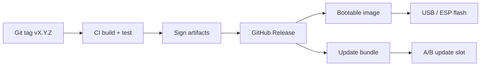

# Deployment Guide

This document describes how Aether OS **release artifacts** are built, verified, and deployed.
**Current milestone:** M2. There are **no production deployment artifacts** yet — this guide
documents the present developer workflow and the **planned** release pipeline.

## Current state (M2)

| Capability | Status |
|------------|--------|
| Local boot artifact build (`make boot`) | **Available** |
| QEMU smoke test (`make run`) | **Available** |
| CI cross-target builds | **Available** |
| Published signed release images | **Not available** |
| Real PC hardware deployment | **Untested** |
| Atomic OS updates | **Not implemented** — host skeleton in `system/updater/`; spec: [updates/README.md](updates/README.md) |
| Application packages | **Not installable at runtime** — host scaffold in `system/pkgmgr/`; spec: [packages/README.md](packages/README.md) |

## Developer deployment (today)

### Build boot artifacts

```bash
make boot
```

Produces:

```
build/esp/EFI/BOOT/BOOTX64.EFI    # UEFI boot loader
build/esp/aether/kernel.elf       # Bare-metal kernel
```

The build scripts assemble a FAT32 disk image for QEMU. See [BUILD.md](BUILD.md).

### Run under QEMU

```bash
make run
# Serial output: build/qemu-serial.log
```

This is the **only verified deployment target** as of M2.

### CI artifacts

The CI workflow (`.github/workflows/ci.yml`) verifies:

1. Formatting, Clippy, host tests
2. UEFI boot loader release build
3. Bare-metal kernel release build
4. Optional QEMU boot smoke test (Ubuntu, `continue-on-error: true`)

CI does **not** publish bootable images to GitHub Releases yet.

## Planned release pipeline (M10)



### Planned artifacts

| Artifact | Format | Purpose |
|----------|--------|---------|
| `aether-boot.img` | Raw disk image with FAT32 ESP | QEMU and USB boot |
| `aether-update.aup` | Signed update bundle | Atomic A/B update |
| `SHA256SUMS` | Checksums | Integrity verification |
| `aether-os-vX.Y.Z-notes.md` | Release notes | From CHANGELOG |

### Signing (planned)

- Release signing keys held by maintainers (offline or HSM)
- Boot loader verifies kernel signature before handoff (future ADR)
- Update bundles signed with project release key; public key pinned in boot chain

See [updates/README.md](updates/README.md) for the atomic update architecture.

## Real hardware deployment (planned, Tier 2)

**Status:** Not verified. The boot path is designed for UEFI x86_64 PCs but has not been
tested on physical hardware.

### Planned steps (illustrative)

1. Build boot artifacts: `make boot`
2. Create a FAT32 EFI System Partition on target media
3. Copy `BOOTX64.EFI` to `EFI/BOOT/`
4. Copy `kernel.elf` to `aether/` on the ESP
5. Boot firmware in UEFI mode (Secure Boot disabled until signing is implemented)
6. Connect serial console (COM1, 115200 8N1) for diagnostics

### Hardware requirements

See [hardware/README.md](hardware/README.md) for the compatibility matrix.

| Requirement | Minimum |
|-------------|---------|
| CPU | x86_64 with long mode |
| Firmware | UEFI (BIOS-only not supported) |
| RAM | 512 MiB (planned minimum) |
| Storage | ESP with ~16 MiB free for boot artifacts |
| Console | Serial (COM1) strongly recommended for bring-up |

## Environment variables

| Variable | Default | Purpose |
|----------|---------|---------|
| `RUSTC_BOOTSTRAP` | `1` (CI) | Enable `build-std` for bare-metal kernel |
| `RUSTFLAGS` | `-Dwarnings` (CI) | Deny warnings in CI builds |
| `TIMEOUT` | `30` | QEMU run timeout in seconds (`run-qemu.sh`) |
| `OVMF_CODE` | auto-detect | Override OVMF code firmware path |
| `OVMF_VARS` | auto-detect | Override OVMF vars firmware path |

## Rollback and recovery (planned M10)

| Scenario | Planned behavior |
|----------|------------------|
| Update verification fails | Boot previous slot (A/B) |
| Kernel panic on boot | Boot loader falls back to previous kernel version |
| Corrupted ESP | Manual recovery from USB install media |

Not implemented in M2.

## Security considerations

- **Do not deploy M2 builds on security-sensitive systems.** There is no paging isolation,
  no signature verification, and no user/kernel boundary.
- QEMU and developer builds are for **testing only**.
- Report vulnerabilities: **security@aether-os.dev** ([SECURITY.md](../SECURITY.md)).

## Monitoring and observability (today)

| Signal | Source |
|--------|--------|
| Boot banner | COM1 serial (`Aether OS kernel started`) |
| M2 init confirmation | Serial (`Aether OS M2: GDT/IDT/interrupts initialized`) |
| Timer health | Serial (`[timer] tick N` every ~1 s) |
| CI status | GitHub Actions badge |

Structured logging (`aether-logger`) is used in host builds; bare-metal serial is the runtime
diagnostic channel until a logging subsystem ships.

## Related documents

- [BUILD.md](BUILD.md) — build reference
- [INSTALL.md](INSTALL.md) — developer environment setup
- [ROADMAP.md](ROADMAP.md) — M10 milestone definition
- [updates/README.md](updates/README.md) — atomic update architecture
- [packages/README.md](packages/README.md) — application packaging
- [hardware/README.md](hardware/README.md) — hardware compatibility
