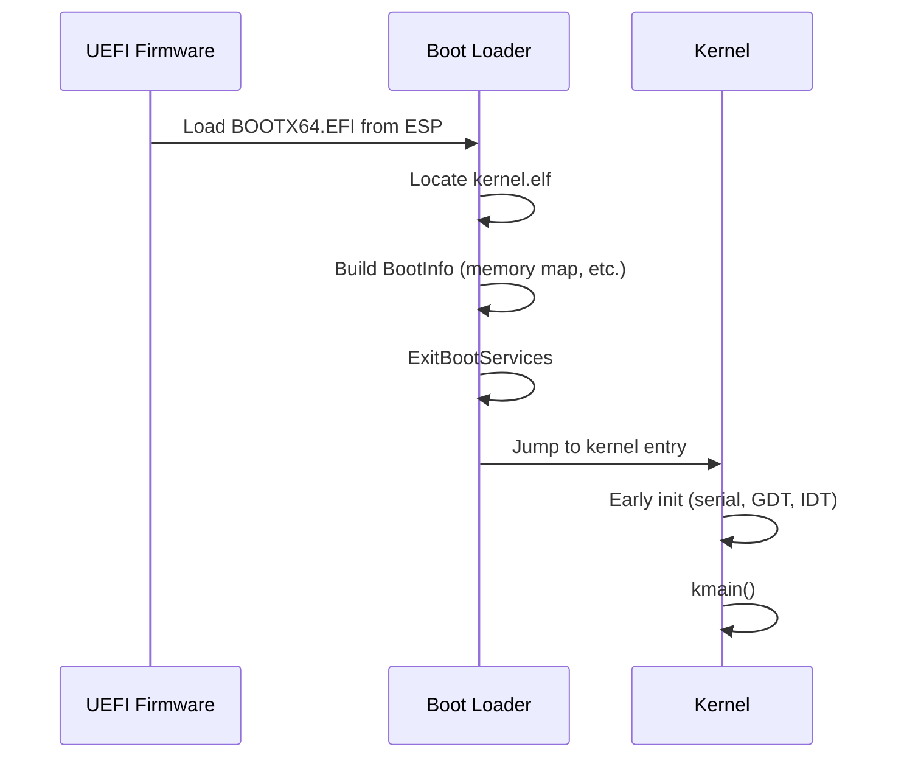

# ADR-0006: Boot Architecture

**Status:** Accepted — **M1 boot path implemented** (QEMU serial verified in CI)  
**Date:** 2026-08-11  
**Milestone:** M1

## Context

The boot path determines firmware dependencies, disk layout, and the kernel's first
instructions. Legacy BIOS and multiboot add complexity; UEFI is standard on QEMU
and modern PCs.

## Decision

Use a **three-stage boot architecture**:



**Disk layout (ESP, FAT32):**

```
EFI/BOOT/BOOTX64.EFI    ← UEFI boot loader (Rust, x86_64-unknown-uefi)
aether/kernel.elf       ← kernel ELF (x86_64-unknown-none)
```

**Handoff:** fixed-layout `BootInfo` structure (planned in `aether-types`) passed
by pointer in a dedicated register at kernel entry.

**Policy:**

- UEFI only — no legacy BIOS support.
- Boot loader exits boot services before kernel entry.
- Kernel does not return to firmware or boot loader code.

M1 implements `boot/` and kernel entry. Full UEFI memory-map copy and hardware PC boot remain M2 follow-ups.

**M1 verification:** QEMU `q35` + OVMF + FAT ESP; serial log must contain `Aether OS kernel started`.

## Consequences

### Positive

- Modern firmware services (memory map, GOP, disk I/O) available during boot loader phase.
- Rust `uefi` crate ecosystem for boot loader development.
- Clear separation between boot loader and kernel responsibilities.

### Negative

- Depends on OVMF/firmware correctness and ESP partitioning.
- Secure Boot and signed boot loader chain deferred to post-M1 ADR.
- Larger firmware attack surface until boot services are exited.

### Follow-ups

- Define `BootInfo` layout in `aether-types` (M1).
- Document QEMU/OVMF versions in hardware matrix when boot is verified.
