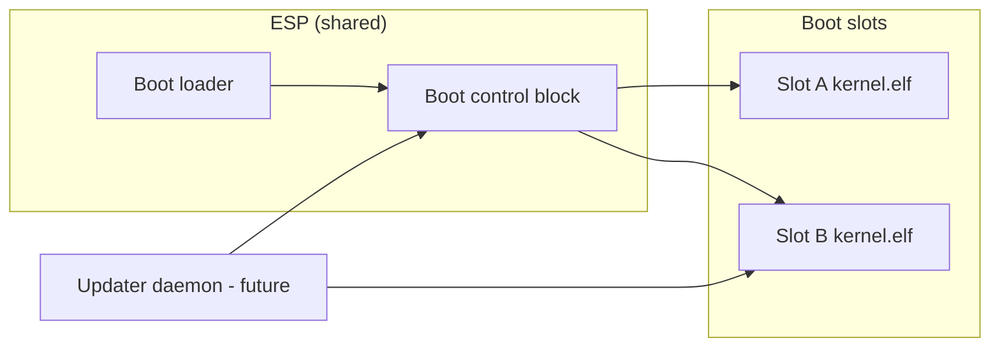

# ADR-0009: Atomic Update Architecture

**Status:** Accepted — **M12 skeleton** (types, docs, host stubs; no runtime apply)  
**Date:** 2026-08-11  
**Milestone:** M12

## Context

Aether OS requires a secure, recoverable update path for the kernel and future system
images. Partial updates that brick the device violate the project security goals described
in [ARCHITECTURE.md](../../ARCHITECTURE.md) and [threat-model.md](../security/threat-model.md).

Constraints:

- UEFI boot path with FAT ESP ([ADR-0006](ADR-0006-boot-architecture.md)).
- No user space until M6 — updater logic must be specifiable early as shared types.
- Maintainer signing keys are not yet established ([ADR-0007](ADR-0007-reproducible-builds-intent.md)).

## Decision

Adopt an **A/B partition update model** with:

1. **Two boot slots** (A and B) — updates stage to the inactive slot.
2. **Boot control block** — persisted metadata selecting the active slot, tracking boot failures, and slot lifecycle state.
3. **Signed update manifests** — Ed25519 detached signatures over canonical manifest bytes; SHA-256 payload digest.
4. **Automatic rollback** — after N consecutive failed boots on the active slot, switch to the last bootable inactive slot.
5. **Host-testable skeleton** — `aether-updater` crate and `scripts/update-check.ps1` validate types and manifest fixtures in CI without real crypto keys.

**Non-goals in M12:**

- Writing to real partition tables or rebooting into a new slot.
- Production Ed25519 verification (stub accepts zero test signatures only).
- Delta/incremental updates.

## Consequences

### Positive

- Failed updates retain a known-good slot — aligns with "signed atomic updates" security goal.
- Types and docs land before init exists, enabling boot loader and CI work in parallel.
- Rollback policy is explicit and unit-testable without hardware.

### Negative

- Doubles kernel partition space (acceptable for embedded/PC targets; may refine for constrained devices).
- Boot loader must understand slot metadata — adds boot-path complexity.
- Key rotation and downgrade policy require follow-up ADRs.

### Follow-ups

- Boot loader reads `BootControlBlock` and selects slot (post-M12).
- Real Ed25519 verification with pinned public keys in boot loader and updater.
- QEMU dual-slot disk image in build scripts.
- Init daemon `aether-updated` applying manifests after M6.

## References

- [docs/updates/README.md](../updates/README.md)
- [`system/updater/`](../../system/updater/)
- [ARCHITECTURE.md § Update strategy](../../ARCHITECTURE.md#update-strategy)
