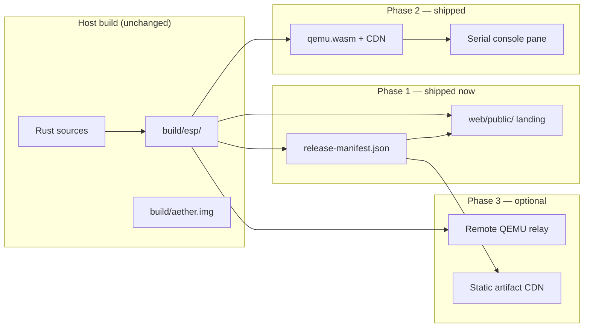

# ADR-0010: Browser VM Architecture for Aether Universal Platform

**Status:** Accepted — Phase 2 in-browser boot shipped (serial-only)  
**Date:** 2026-08-12  
**Milestone:** Universal Platform M1 (web delivery)

## Context

Aether OS ships as **x86_64 UEFI** artifacts today:

```
build/esp/EFI/BOOT/BOOTX64.EFI
build/esp/aether/kernel.elf
```

QEMU + OVMF is the only verified runtime ([ADR-0006](ADR-0006-boot-architecture.md)). A
**Universal Platform** goal requires serving these same artifacts to browsers without
simulating a fake desktop or rewriting the kernel boot path.

Browser emulators differ sharply in firmware support:

| Approach | UEFI/OVMF | x86_64 guest | Maturity | Fits current Aether boot |
|----------|-----------|--------------|----------|--------------------------|
| **v86** (SeaBIOS) | No — issue [#263](https://github.com/copy/v86/issues/263) open since 2018 | No 64-bit Linux/OS | Production for 32-bit guests | **No** |
| **qemu.wasm** / **ktock/qemu-wasm** | Yes (OVMF pflash drives) | Yes (experimental wasm64 TCG) | Research / early 2025–2026 | **Yes** (with integration work) |
| **Remote QEMU** (WebSocket serial) | Yes (host runs QEMU) | Yes | Production pattern | **Yes** (interim demo) |
| **BIOS/multiboot web-only boot path** | N/A | Would need new loader | N/A | **Rejected** — kernel rewrite / dual boot scope |

**Constraint:** Do not rewrite the kernel or add a parallel BIOS boot chain solely for web.
The browser must eventually run the **same** `BOOTX64.EFI` + `kernel.elf` ESP layout.

## Decision

Adopt a **three-phase browser delivery architecture**:



### Phase 1 (this ADR) — Honest scaffold

1. **`scripts/build-web-artifacts.ps1`** copies ESP artifacts into `web/public/artifacts/` and emits `web/public/manifest.json` with SHA-256 checksums.
2. **`web/`** static site documents boot status, links local QEMU instructions, and exposes manifest metadata — **no fake OS UI**.
3. **`docs/security/web-threat-model.md`** defines trust boundaries for artifact delivery and future VM embedding.
4. **GitHub issue** tracks Phase 2 qemu.wasm integration milestone.

### Phase 2 — In-browser real boot (target)

Integrate **qemu.wasm** (or upstream QEMU wasm64 TCG when stable):

- Preload `OVMF_CODE.fd`, `OVMF_VARS.fd`, and FAT ESP (`build/esp/` or `aether.img`).
- QEMU args mirror `scripts/run-qemu.ps1`: `q35`, pflash OVMF, `-serial stdio` bridged to a Web Worker.
- Display **real COM1 serial output** in the page; optional GOP framebuffer when M8 ships.
- No synthetic terminal commands — output is whatever the kernel prints.

### Phase 3 — Optional acceleration

- **Remote QEMU relay:** server runs QEMU with artifact hash verification; browser streams serial only. Useful for low-end mobile until wasm performance improves.
- **CDN + SRI:** serve versioned artifacts with manifest signatures aligned to M10 update keys.

### Explicitly rejected

| Option | Reason |
|--------|--------|
| v86 + SeaBIOS booting current Aether | No UEFI; 64-bit guest unsupported |
| v86 + FAT ESP without UEFI | Boot loader is `BOOTX64.EFI`; SeaBIOS cannot execute it |
| Fake terminal / fake desktop UI | Violates Universal Platform integrity requirement |
| BIOS/multiboot-only web kernel | Requires new boot path; out of scope |

## Consequences

### Positive

- Same release artifacts for QEMU, packaging, and browser — no forked “web kernel”.
- Manifest pipeline is reusable for M10 signed updates.
- Honest UX avoids misleading demos.
- qemu.wasm path preserves UEFI fidelity when integrated.

### Negative

- **No in-browser GUI in Phase 2.** Serial boot only until M8 framebuffer ships.
- qemu.wasm bundle size is large (WASM + OVMF + disk image); lazy loading and compression required.
- Browser JIT limits (Safari wasm64, memory caps) may require remote relay on mobile.
- OVMF redistribution/licensing must be documented in `web/README.md`.

### Follow-ups

- [x] Integrate qemu.wasm with serial bridge (Phase 2 — https://d1bakar.github.io/ather-os/)
- [x] CI job: `build-web-artifacts.ps1` after boot build; OVMF + Pages deploy
- [ ] Mobile touch/keyboard UX ([web-threat-model](../security/web-threat-model.md))
- [ ] Re-evaluate v86 only if UEFI support lands or Aether adds an approved alternate boot ADR

## References

- [ADR-0006: Boot architecture](ADR-0006-boot-architecture.md)
- [v86 UEFI issue #263](https://github.com/copy/v86/issues/263)
- [ktock/qemu-wasm](https://github.com/ktock/qemu-wasm)
- [QEMU wasm64 TCG patches (2026)](https://lists.nongnu.org/archive/html/qemu-devel/2026-01/msg04985.html)
