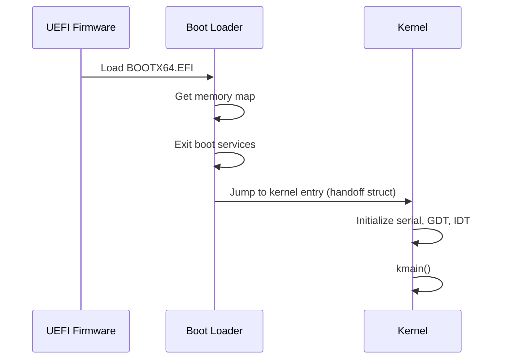
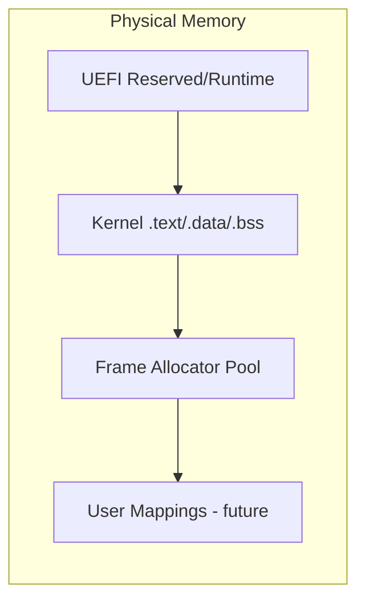
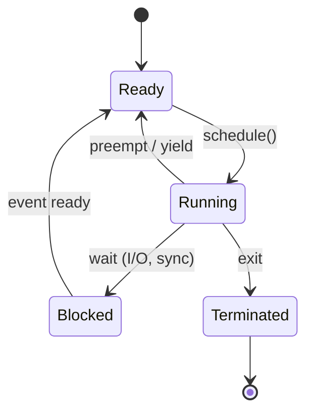

# ADR 001: Initial Architecture Decisions

> **Note:** This consolidated document predates the numbered ADR series. See
> [docs/adr/](../adr/) for individual ADR-0001 through ADR-0007 records.

**Status:** Accepted  
**Date:** 2026-08-11  
**Milestone:** M0

## Context

Aether OS is a new operating system being built from scratch. Before writing boot
loader or kernel code, we must establish foundational technology choices that
will constrain all subsequent design. These decisions are recorded here so future
contributors understand the rationale and can propose changes through the ADR process.

## Decision

### Why Rust

| Factor | Rationale |
|--------|-----------|
| Memory safety | Eliminates large classes of bugs (use-after-free, buffer overflows) at compile time |
| Zero-cost abstractions | Newtypes, enums, and traits compile to efficient machine code |
| Ecosystem | `no_std` support, mature tooling (cargo, clippy, miri), active OS dev community |
| Cross-compilation | First-class support for bare-metal x86_64 targets |
| Documentation | `#![deny(missing_docs)]` enforces API documentation culture |

**Trade-off:** Steeper learning curve for contributors unfamiliar with Rust ownership.
Kernel code will require targeted `unsafe` blocks with documented invariants; shared
crates use `#![forbid(unsafe_code)]`.

### Why x86_64

| Factor | Rationale |
|--------|-----------|
| Hardware availability | Ubiquitous development machines and cloud VMs |
| Documentation | Intel SDM, AMD APM, OSDev wiki, extensive prior art |
| Tooling | QEMU, GDB, OVMF, and cross-compilers are mature |
| 64-bit only | Simplifies design — no compatibility mode, full 64-bit address space |

**Trade-off:** x86_64 has legacy complexity (PIC vs APIC, segmentation remnants).
We accept this in exchange for developer accessibility.

### Why UEFI

| Factor | Rationale |
|--------|-----------|
| Modern standard | Replaces legacy BIOS; supported on all current hardware and QEMU |
| Services | Memory map, GOP framebuffer, disk I/O available at boot |
| Rust ecosystem | `uefi` crate provides safe wrappers for UEFI protocols |
| No real-mode | Avoids 16-bit startup code entirely |

**Boot flow:**



**Trade-off:** UEFI adds firmware dependency. Legacy BIOS boot is out of scope.

### Why Monolithic Kernel

| Factor | Rationale |
|--------|-----------|
| Simplicity | Single address space, direct function calls between subsystems |
| Performance | No IPC overhead for common operations (scheduling, memory, VFS) |
| Rust alignment | Shared types and ownership across subsystems without serialization |
| Incremental growth | Start monolithic; extract to modules with clear boundaries |

**Trade-off:** A bug in one subsystem can corrupt the entire kernel. Mitigated by
Rust safety, `#![forbid(unsafe_code)]` in shared crates, and extensive testing.

**Future option:** If isolation requirements emerge, specific drivers may move to
user-space without changing the core monolithic design.

### Boot Strategy

1. **M1:** UEFI boot loader (`boot/`) loads kernel ELF from FAT32 ESP partition.
2. Boot loader collects UEFI memory map and passes it to the kernel via a fixed
   handoff structure (`BootInfo`).
3. Boot loader calls `ExitBootServices`, then jumps to kernel entry point.
4. Kernel never returns to UEFI or boot loader code.

```
ESP (FAT32)
├── EFI/BOOT/BOOTX64.EFI    ← boot loader
└── aether/
    └── kernel.elf           ← kernel binary
```

### Initial Memory Model



- **Physical allocator:** Bitmap or buddy allocator over UEFI free pages (M2).
- **Virtual memory:** 4-level page tables (PML4 → PDPT → PD → PT), 4 KiB pages
  with optional 2 MiB huge pages for kernel mappings.
- **Kernel layout:**
  - Higher-half kernel at `0xFFFF_8000_0000_0000` (canonical address).
  - User space below `0x0000_8000_0000_0000`.
- **Types:** `PhysicalAddress`, `VirtualAddress`, `PageFlags` defined in `aether-types`.

### Initial Scheduler Approach

- **M3 target:** Preemptive, priority-based round-robin scheduler.
- **M1 stub:** Cooperative yield via `SYSCALL Yield` (syscall #7).
- **Process model:** Each process has a kernel stack, user stack, page table root,
  and a `TaskControlBlock` holding register state.
- **Timer:** APIC timer interrupt for preemption (M3).



### Filesystem Strategy

- **M5 target:** Virtual filesystem (VFS) layer with pluggable backends.
- **Initial backends:**
  - **tmpfs** — in-memory filesystem for `/tmp`, `/dev`, early root.
  - **devfs** — device nodes (`/dev/serial`, `/dev/null`).
- **On-disk:** ext2 or a custom simple FS deferred to post-M5.
- **Boot root:** Kernel and init loaded by boot loader from ESP; root tmpfs
  populated by kernel init process.

## Consequences

### Positive

- Clear, documented foundation for all M1+ work.
- Shared crates (`aether-types`, `aether-abi`, `aether-logger`) usable by boot loader,
  kernel, and host tooling from day one.
- CI enforces quality from M0.

### Negative

- x86_64-only limits hardware portability (ARM/RISC-V deferred).
- UEFI-only excludes legacy BIOS systems.
- Monolithic design may require refactoring if microkernel isolation is needed later.

## References

- [Intel SDM Volume 3](https://www.intel.com/content/www/us/en/developer/articles/technical/intel-sdm.html)
- [UEFI Specification 2.10](https://uefi.org/specifications)
- [OSDev Wiki](https://wiki.osdev.org/)
- [rust-osdev ecosystem](https://github.com/rust-osdev)
