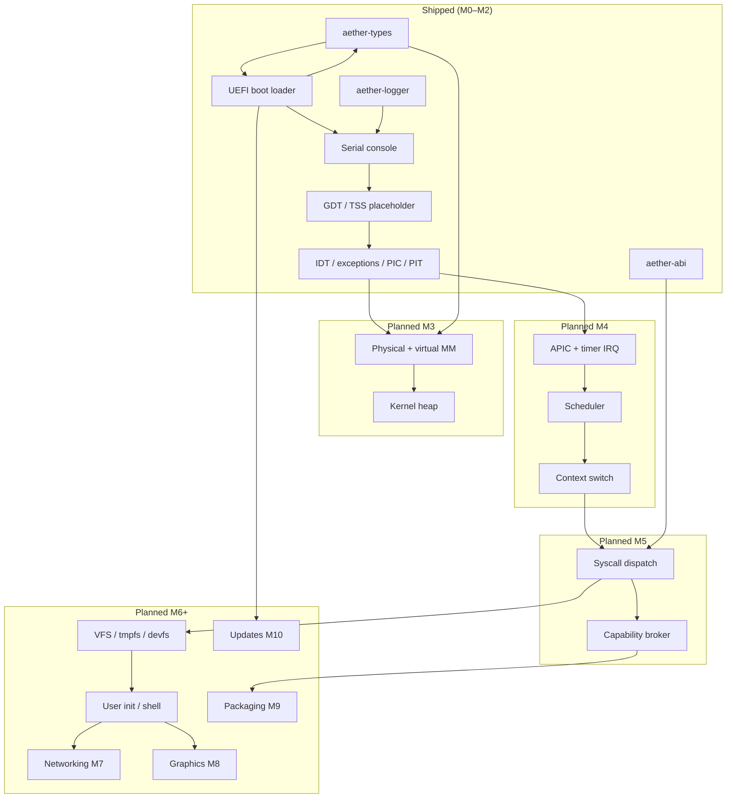

# Kernel Architecture Documentation

This directory indexes **design-intent documentation** for Aether OS kernel and platform subsystems.

Nothing here implies a subsystem is implemented unless explicitly marked **shipped**.

For the consolidated system view, see [ARCHITECTURE.md](../../ARCHITECTURE.md).

For numbered decisions, see [docs/adr/](../adr/).

## Status legend

| Marker | Meaning |

|--------|---------|

| **Shipped** | Code exists, verified in CI or documented manual test |

| **Partial** | Scaffold or minimal implementation; not feature-complete |

| **Planned** | Design documented; no runtime implementation |

## Subsystem index

| Subsystem | Responsibility | Milestone | Status | Primary references |

|-----------|----------------|-----------|--------|-------------------|

| **Foundation** | Shared types, ABI, logging | M0 | **Shipped** | `crates/aether-types`, `aether-abi`, `aether-logger` |

| **Boot** | UEFI loader, `BootInfo` handoff | M1 | **Shipped** (QEMU) | [ADR-0006](../adr/ADR-0006-boot-architecture.md), [boot/README.md](../../boot/README.md) |

| **Serial / early console** | COM1 UART for bring-up | M1 | **Shipped** | `kernel/src/serial.rs` |

| **CPU / arch** | GDT, IDT, PIC/PIT, APIC | M2–M4 | **Shipped M2** (PIC/PIT); APIC planned M4 | [ADR-0008](../adr/ADR-0008-interrupt-architecture.md) |

| **Memory (`mm/`)** | Frames, page tables, heap | M3 | **Planned** | [ARCHITECTURE.md § Memory](../../ARCHITECTURE.md#memory-model-design) |

| **Scheduler (`sched/`)** | Tasks, preemption, context switch | M4 | **Planned** | [ARCHITECTURE.md § Process](../../ARCHITECTURE.md#process-model-design) |

| **Syscalls** | User/kernel boundary, dispatch | M5 | **Planned** | [ADR-0005](../adr/ADR-0005-syscall-abi-strategy.md) |

| **Capabilities (`cap/`)** | Object rights, delegation | M5 | **Planned** | [ADR-0004](../adr/ADR-0004-capability-security-model.md) |

| **VFS / FS (`fs/`)** | tmpfs, devfs, VFS layer | M6 | **Planned** | [ARCHITECTURE.md § Filesystem](../../ARCHITECTURE.md#filesystem-strategy) |

| **User space** | libc, init, shell | M6 | **Planned** | [user/README.md](../../user/README.md) |

| **Networking** | VirtIO net, TCP/IP stack | M7 | **Planned** | [ROADMAP.md § M7](../ROADMAP.md#m7--networking-planned) |

| **Graphics / input** | Framebuffer, keyboard | M8 | **Planned** | [ROADMAP.md § M8](../ROADMAP.md#m8--graphics-and-input-planned) |

| **Packaging** | `.aetherpkg` format, package manager | M9 | **Planned** (host scaffold) | [packages/README.md](../packages/README.md) |

| **Updates** | A/B slots, signed `.aup` bundles | M10 | **Planned** (host scaffold) | [updates/README.md](../updates/README.md) |

## Subsystem dependency graph

## Historical document

[001-initial-decisions.md](001-initial-decisions.md) predates numbered ADRs and consolidates

early M0 choices. Prefer individual ADRs and [ARCHITECTURE.md](../../ARCHITECTURE.md) for

current design intent.

## Related documents

- [docs/development/getting-started.md](../development/getting-started.md) — environment setup and first boot

- [docs/development/code-style.md](../development/code-style.md) — Rust kernel conventions

- [docs/security/threat-model.md](../security/threat-model.md) — security assumptions and adversaries

- [docs/hardware/README.md](../hardware/README.md) — hardware compatibility matrix

- [docs/ROADMAP.md](../ROADMAP.md) — milestone plan M0–M10

