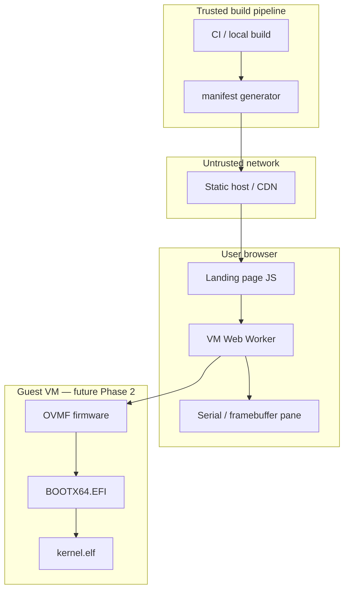

# Aether Universal Platform — Web Threat Model

This document extends [threat-model.md](threat-model.md) with trust boundaries for
delivering and running Aether OS artifacts in a browser context.

**Status:** Phase 1 — design for manifest delivery and future in-browser VM.  
**Related ADR:** [ADR-0010](../adr/ADR-0010-browser-vm-architecture.md).

## Scope

| In scope | Out of scope (Phase 1) |
|----------|-------------------------|
| Static hosting of boot artifacts (`BOOTX64.EFI`, `kernel.elf`) | Remote QEMU relay authentication (Phase 3) |
| Manifest integrity (SHA-256; Ed25519 when M10 lands) | Browser sandbox escape in guest OS |
| Web Worker VM isolation | Supply chain for qemu.wasm upstream |
| User expectations (demo vs production) | Windows 11 host hardening |

## Assets

| Asset | Description | Phase 1 controls |
|-------|-------------|------------------|
| **Boot artifacts** | UEFI loader + kernel ELF | Checksums in manifest; same bits as `build/esp/` |
| **release-manifest.json** | Version, paths, hashes | Generated by trusted build script; future signature |
| **OVMF firmware** | Third-party UEFI firmware | Served read-only; not project-authored |
| **Serial stream** | COM1 output from real VM | Read-only display; no command injection into guest |
| **User browser** | Local storage, clipboard | No persistent secrets required for demo |

## Trust boundaries

| Boundary | Threat | Mitigation |
|----------|--------|------------|
| Build → manifest | Tampered artifact hashes | CI generates manifest; compare with local `build-web-artifacts.ps1` |
| CDN → browser | MITM artifact swap | HTTPS; Subresource Integrity when embedded; M10 signed manifest |
| Page → worker | XSS driving VM config | Strict CSP; worker loads only same-origin artifact URLs |
| Worker → guest | Malicious disk image | Only load paths listed in verified manifest |
| Guest → host | VM escape | Browser sandbox + no host filesystem mounts in Phase 2 |
| User perception | Fake OS UI misrepresentation | No simulated shell; serial output only from emulator |

## Adversaries

1. **Network attacker** — replaces `kernel.elf` on download.  
   *Mitigation:* manifest SHA-256 verify before VM start; future Ed25519 signature (M10).

2. **Malicious static host** — serves outdated vulnerable kernel.  
   *Mitigation:* version pinning in manifest; reproducible build hashes in release notes.

3. **XSS on landing page** — exfiltrates clipboard or redirects artifact URLs.  
   *Mitigation:* CSP `default-src 'self'`; no inline scripts in production build; sanitize manifest display.

4. **Resource exhaustion** — user tricked into booting huge image on mobile.  
   *Mitigation:* manifest size fields; warn before download; default to local QEMU on low memory.

## Mobile considerations

| Concern | Approach |
|---------|----------|
| Touch input | Future: pointer events → PS/2 or virtio-input in qemu.wasm config |
| Virtual keyboard | Optional on-screen keyboard sending scancodes to worker — not a fake shell |
| Viewport | Responsive serial pane; framebuffer letterboxing when M8 GOP available |
| Performance | wasm64 TCG may be slow; remote relay fallback documented |

## Security requirements by phase

### Phase 1 (current)

- [x] Document trust boundaries (this file)
- [x] Manifest includes SHA-256 for each artifact
- [ ] CSP headers on static host (deployment checklist)
- [ ] No execution of user-supplied disk images

### Phase 2 (qemu.wasm)

- [ ] Verify manifest before preload
- [ ] Worker isolated from DOM except `postMessage` serial channel
- [ ] OVMF vars writable copy only in worker memory — not persisted to host disk

### Phase 3 (remote relay)

- [ ] TLS + token-scoped serial sessions
- [ ] Rate limits; no arbitrary QEMU CLI from client

## Reporting

Web-specific vulnerabilities (XSS, manifest bypass, worker sandbox issues):  
**security@aether-os.dev** — see [SECURITY.md](../../SECURITY.md).
