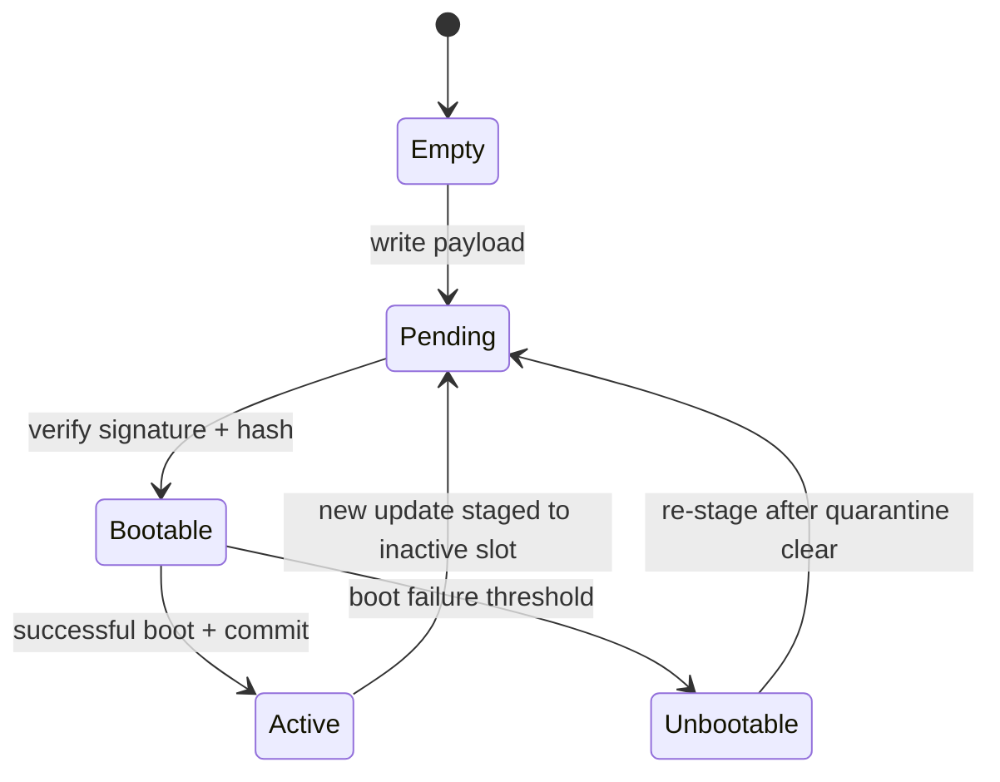
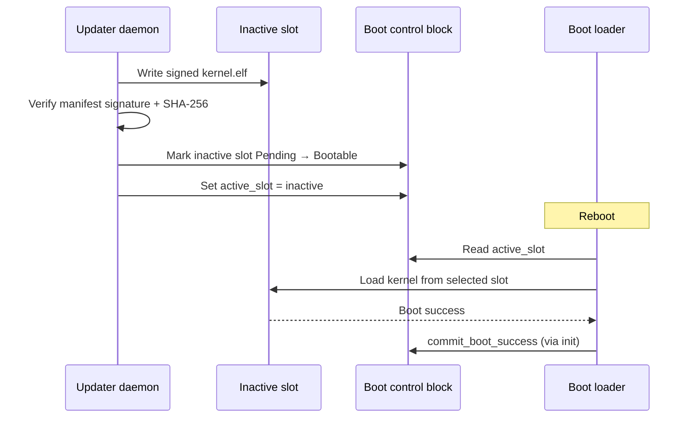

# A/B Partition Design

> **Status:** M12 design — boot control block types shipped in `aether-updater`; disk layout not applied at runtime.

## Overview

Aether OS maintains two bootable **slots** (A and B). At any time exactly one slot is
**active** (selected for boot). Updates are staged into the **inactive** slot, verified,
marked bootable, and only then selected for the next reboot.

## Disk layout (intent)

| Region | Purpose | Notes |
|--------|---------|-------|
| ESP (FAT32) | `EFI/BOOT/BOOTX64.EFI`, boot control block file | Shared across slots |
| Slot A partition | `kernel.elf` + future initrd | Primary dev default |
| Slot B partition | `kernel.elf` + future initrd | Staging target for updates |
| Shared `/var` (future) | Logs, user data | Not replaced on kernel update |

QEMU development images may use a single ESP plus two ext4/tmpfs placeholders until
partition tooling lands in M6.

## Boot control block

The [`BootControlBlock`](../../system/updater/src/partition.rs) structure is persisted
as `aether/boot_control.bin` on the ESP (filename TBD). Fields:

| Field | Purpose |
|-------|---------|
| `magic` / `version` | Structure identification (`AETHBCB!`, version `1`) |
| `active_slot` | Slot selected on next boot (`A` or `B`) |
| `failed_boots` | Consecutive failed boots on the active slot |
| `rollback_threshold` | Auto-rollback after N failures (default `3`) |
| `slot_a` / `slot_b` | Per-slot [`SlotStatus`](../../system/updater/src/partition.rs) |

### Slot status

Each slot tracks:

- **`state`** — `Empty`, `Pending`, `Bootable`, `Active`, or `Unbootable`
- **`boot_attempts`** — monotonic counter for diagnostics
- **`version`** — semantic version label of the installed image

## Update staging flow

## Boot loader responsibilities (planned)

1. Read and validate `BootControlBlock` magic/version.
2. Refuse to boot slots in `Empty`, `Pending`, or `Unbootable` state.
3. Increment `failed_boots` on kernel handoff timeout or explicit failure marker.
4. Trigger automatic rollback when `failed_boots >= rollback_threshold`.

## Follow-ups

- Define on-disk serialization (fixed binary vs. CBOR) in ADR-0009 follow-up.
- Integrate slot paths into `scripts/build-boot.sh` for dual-slot QEMU images.
- Measured boot / Secure Boot interaction (post-M12 ADR).
