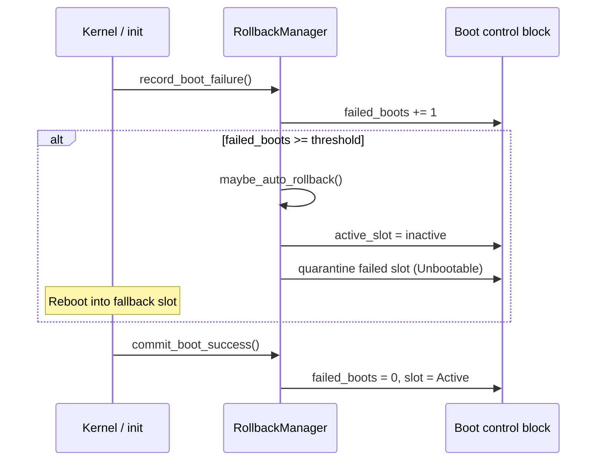

# Rollback API

> **Status:** M12 skeleton — in-memory [`RollbackManager`](../../system/updater/src/rollback.rs) only; no reboot or persistence.

## When rollback happens

| Trigger | Reason enum | Automatic? |
|---------|-------------|------------|
| User/admin command | `UserRequested` | No |
| Boot failure threshold exceeded | `BootFailureThreshold` | Yes |
| Init health check failure (future) | `HealthCheckFailed` | Yes |
| Pre-commit verification failure | `UpdateVerificationFailed` | Yes (before slot switch) |

Automatic rollback uses `BootControlBlock.rollback_threshold` (default **3** consecutive
failed boots on the active slot).

## API surface

### Types

- [`RollbackRequest`](../../system/updater/src/rollback.rs) — reason + whether to quarantine the failed slot
- [`RollbackResult`](../../system/updater/src/rollback.rs) — previous and new active slots
- [`RollbackManager`](../../system/updater/src/rollback.rs) — state machine over `BootControlBlock`

### Operations

| Method | Behavior |
|--------|----------|
| `can_rollback()` | Returns `true` if inactive slot is `Bootable` or `Active` |
| `rollback(request)` | Switches `active_slot`, optionally quarantines failed slot |
| `maybe_auto_rollback()` | Rolls back when failure threshold reached |
| `commit_boot_success()` | Resets `failed_boots`, marks slot `Active` |
| `record_boot_failure()` | Increments `failed_boots` |

## Rollback sequence

## Quarantine semantics

When `quarantine_failed_slot: true` (default), the previously active slot transitions to
`Unbootable`. It may be re-staged only after explicit operator action or a future
"clear quarantine" admin command.

## Error conditions

| Error | Meaning |
|-------|---------|
| `RollbackUnavailable` | Inactive slot is `Empty`, `Pending`, or `Unbootable` |
| `InvalidManifest` | Boot control block failed validation |

## Future init integration (planned)

1. Early init reads boot control block from ESP.
2. On success path, init calls `commit_boot_success()` and persists the block.
3. On panic/watchdog path, firmware or boot loader increments failures before next boot.
4. User-facing `aether-update rollback` CLI wraps `RollbackManager::rollback`.

## Testing

Unit tests in `system/updater/src/rollback.rs` cover manual rollback, automatic threshold
rollback, and unavailable fallback scenarios. Host CI runs via `cargo test -p aether-updater`.
