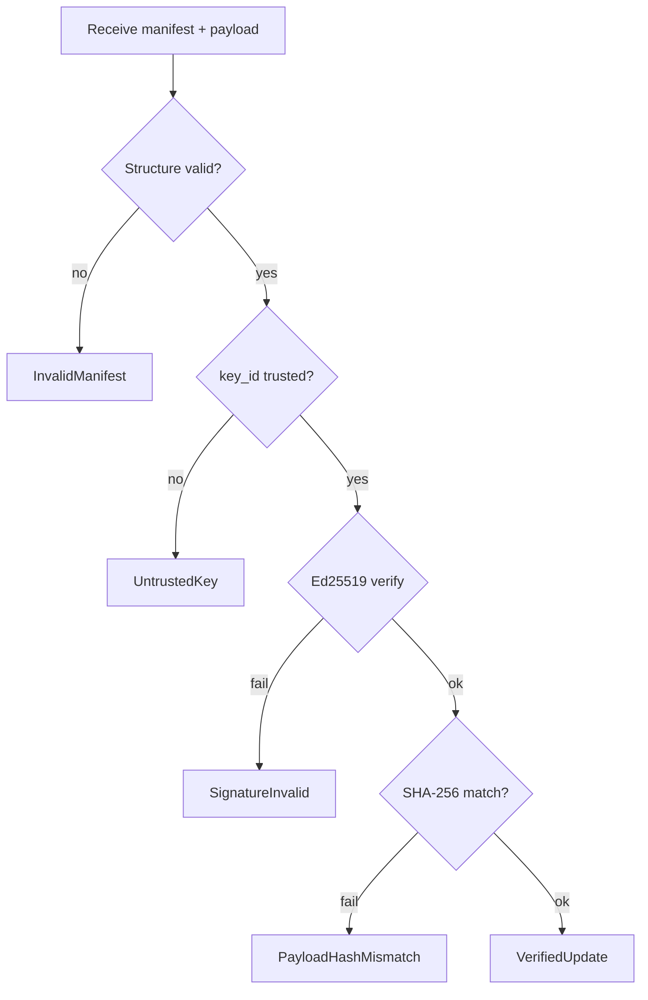

# Signed Update Verification

> **Status:** M12 skeleton — `StubVerifier` accepts zero signatures in dev; Ed25519 verification planned.

## Trust model

| Layer | Trust anchor | M12 state |
|-------|--------------|-----------|
| Maintainer signing key | Offline or HSM-held Ed25519 private key | Not established |
| Public key pinning | Boot loader + updater policy | Design only |
| Manifest signature | Ed25519 detached over canonical bytes | Stub only |
| Payload integrity | SHA-256 hash in manifest | Type defined |

See [threat-model.md](../security/threat-model.md) for adversary assumptions.

## Update manifest

The [`UpdateManifest`](../../system/updater/src/verify.rs) structure describes a single
atomic update payload:

| Field | Description |
|-------|-------------|
| `magic` / `version` | `AETHUPD!`, version `1` |
| `target_slot` | Inactive A/B slot receiving the payload |
| `payload_kind` | `KernelElf` or future `SystemBundle` |
| `algorithm` | `Ed25519` (only supported algorithm in v1) |
| `payload_sha256` | Digest of the raw payload bytes |
| `key_id` | First 8 bytes of SHA-256(trusted public key) |
| `release_version` | Human-readable version label |
| `signature` | 64-byte Ed25519 detached signature |

### Canonical signed message

The signed message **excludes** the `signature` field. M12 uses a fixed 64-byte
canonical prefix (`UpdateManifest::canonical_bytes`) as a placeholder; production will
adopt a documented stable encoding (likely CBOR with deterministic field order).

## Verification pipeline

## Policy

[`VerifyPolicy`](../../system/updater/src/verify.rs) controls:

- **`min_manifest_version`** — reject older manifest layouts.
- **`allow_downgrade`** — default `false`; prevents rolling back to vulnerable releases via update channel.

## Development stub

[`StubVerifier`](../../system/updater/src/verify.rs) with `accept_test_signature: true`
accepts manifests whose signature bytes are all zero. This enables CI and
`scripts/update-check.ps1` to exercise the pipeline without real keys.

**Production builds must disable test signature acceptance.**

## Host tooling

`scripts/update-check.ps1` validates manifest JSON fixtures and runs `cargo test -p aether-updater`.

## Follow-ups

- Integrate `ed25519-dalek` (or firmware crypto module) for real verification.
- Publish maintainer public keys in `system/updater/keys/` (`.pub` only, never private keys).
- ADR for key rotation and revocation list format.
